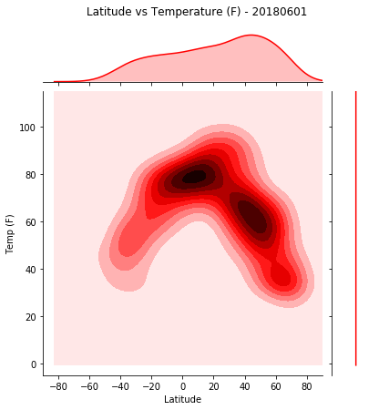
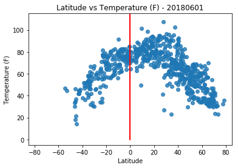
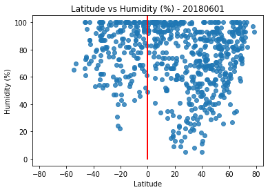
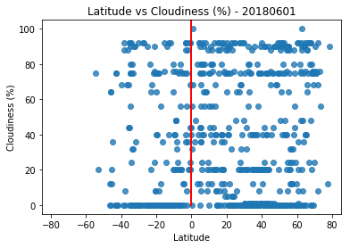
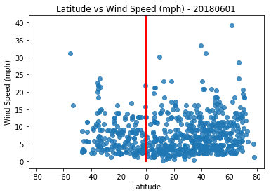

```python
# Dependencies
import openweathermapy.core as owm
import pandas as pd
import numpy as np
from citipy import citipy
from collections import OrderedDict
#import api_key
from config import api_key, gkey
```


```python
#choose random coordinates, store them in dict, write dict to csv (or dataframe)
lat_lngs = []
cities = []

lats = np.random.uniform(low=-90.000, high=90.000, size=2000)
lngs = np.random.uniform(low=-180.000, high=180.000, size=2000)
lat_lngs = zip(lats, lngs)
```


```python
for lat_lng in lat_lngs:
    city = citipy.nearest_city(lat_lng[0], lat_lng[1]).city_name
    if city not in cities:
        cities.append(city)
        
#print(city)
len(cities)
```


    741


```python
# Dependencies
import requests
import urllib
```


```python
#city_data = []
city_lat = []
city_lon = []
city_temp = []
city_humid = []
city_cloud = []
city_wind = []
city_name = []
country = []
city_date = []

# Save config information
url = "http://api.openweathermap.org/data/2.5/weather?"
count = 0
units = "Imperial"

#loop through cities
for city in cities:
    
    # Build query URL
    query_url = url + "units=" + units + "&APPID=" + api_key + "&q=" + urllib.request.pathname2url(city)
   
    #count cities and print urls as they are processed
    count = count + 1
    
    print(f"City #{count} - {city}: {query_url}") 
     
    try:
        # Get weather data
        weather_json = requests.get(query_url).json()
        
        #parse and append temp, humidity, cloudiness, windspeed
        city_lat.append(weather_json["coord"]["lat"])
        city_lon.append(weather_json["coord"]["lon"])
        city_temp.append(weather_json["main"]["temp"])
        city_humid.append(weather_json["main"]["humidity"])
        city_cloud.append(weather_json["clouds"]["all"])
        city_wind.append(weather_json["wind"]["speed"])
        city_name.append(weather_json["name"])
        country.append(weather_json["sys"]["country"])

    #skip error cities
    except:
        print(f"{city} not found...skipping...")
        pass
    
#data collection complete
print("-------------------------")
print("data collection complete")
print("-------------------------")
```

    City #1 - ostrovnoy: http://api.openweathermap.org/data/2.5/weather?units=Imperial&APPID=901f4d36d9890fc0733d0bd77aacaddf&q=ostrovnoy
    City #2 - vaitupu: http://api.openweathermap.org/data/2.5/weather?units=Imperial&APPID=901f4d36d9890fc0733d0bd77aacaddf&q=vaitupu
    vaitupu not found...skipping...
    City #3 - yulara: http://api.openweathermap.org/data/2.5/weather?units=Imperial&APPID=901f4d36d9890fc0733d0bd77aacaddf&q=yulara
    City #4 - samusu: http://api.openweathermap.org/data/2.5/weather?units=Imperial&APPID=901f4d36d9890fc0733d0bd77aacaddf&q=samusu
    samusu not found...skipping...
    City #5 - ushuaia: http://api.openweathermap.org/data/2.5/weather?units=Imperial&APPID=901f4d36d9890fc0733d0bd77aacaddf&q=ushuaia
    City #6 - maragogi: http://api.openweathermap.org/data/2.5/weather?units=Imperial&APPID=901f4d36d9890fc0733d0bd77aacaddf&q=maragogi
    City #7 - arraial do cabo: http://api.openweathermap.org/data/2.5/weather?units=Imperial&APPID=901f4d36d9890fc0733d0bd77aacaddf&q=arraial%20do%20cabo
    City #8 - hermanus: http://api.openweathermap.org/data/2.5/weather?units=Imperial&APPID=901f4d36d9890fc0733d0bd77aacaddf&q=hermanus
    City #9 - port alfred: http://api.openweathermap.org/data/2.5/weather?units=Imperial&APPID=901f4d36d9890fc0733d0bd77aacaddf&q=port%20alfred
    City #10 - bredasdorp: http://api.openweathermap.org/data/2.5/weather?units=Imperial&APPID=901f4d36d9890fc0733d0bd77aacaddf&q=bredasdorp
    City #11 - hithadhoo: http://api.openweathermap.org/data/2.5/weather?units=Imperial&APPID=901f4d36d9890fc0733d0bd77aacaddf&q=hithadhoo
    City #12 - dikson: http://api.openweathermap.org/data/2.5/weather?units=Imperial&APPID=901f4d36d9890fc0733d0bd77aacaddf&q=dikson
    City #13 - markova: http://api.openweathermap.org/data/2.5/weather?units=Imperial&APPID=901f4d36d9890fc0733d0bd77aacaddf&q=markova
    City #14 - ipojuca: http://api.openweathermap.org/data/2.5/weather?units=Imperial&APPID=901f4d36d9890fc0733d0bd77aacaddf&q=ipojuca
    City #15 - lukovetskiy: http://api.openweathermap.org/data/2.5/weather?units=Imperial&APPID=901f4d36d9890fc0733d0bd77aacaddf&q=lukovetskiy
    City #16 - raudeberg: http://api.openweathermap.org/data/2.5/weather?units=Imperial&APPID=901f4d36d9890fc0733d0bd77aacaddf&q=raudeberg
    City #17 - caldwell: http://api.openweathermap.org/data/2.5/weather?units=Imperial&APPID=901f4d36d9890fc0733d0bd77aacaddf&q=caldwell
    City #18 - bluff: http://api.openweathermap.org/data/2.5/weather?units=Imperial&APPID=901f4d36d9890fc0733d0bd77aacaddf&q=bluff
    City #19 - dicabisagan: http://api.openweathermap.org/data/2.5/weather?units=Imperial&APPID=901f4d36d9890fc0733d0bd77aacaddf&q=dicabisagan
    City #20 - upernavik: http://api.openweathermap.org/data/2.5/weather?units=Imperial&APPID=901f4d36d9890fc0733d0bd77aacaddf&q=upernavik
    City #21 - clyde river: http://api.openweathermap.org/data/2.5/weather?units=Imperial&APPID=901f4d36d9890fc0733d0bd77aacaddf&q=clyde%20river
    City #22 - cape town: http://api.openweathermap.org/data/2.5/weather?units=Imperial&APPID=901f4d36d9890fc0733d0bd77aacaddf&q=cape%20town
    City #23 - fairbanks: http://api.openweathermap.org/data/2.5/weather?units=Imperial&APPID=901f4d36d9890fc0733d0bd77aacaddf&q=fairbanks
    City #24 - busselton: http://api.openweathermap.org/data/2.5/weather?units=Imperial&APPID=901f4d36d9890fc0733d0bd77aacaddf&q=busselton
    City #25 - norrtalje: http://api.openweathermap.org/data/2.5/weather?units=Imperial&APPID=901f4d36d9890fc0733d0bd77aacaddf&q=norrtalje
    City #26 - invermere: http://api.openweathermap.org/data/2.5/weather?units=Imperial&APPID=901f4d36d9890fc0733d0bd77aacaddf&q=invermere
    City #27 - jamestown: http://api.openweathermap.org/data/2.5/weather?units=Imperial&APPID=901f4d36d9890fc0733d0bd77aacaddf&q=jamestown
    City #28 - karauzyak: http://api.openweathermap.org/data/2.5/weather?units=Imperial&APPID=901f4d36d9890fc0733d0bd77aacaddf&q=karauzyak
    karauzyak not found...skipping...
    City #29 - mataura: http://api.openweathermap.org/data/2.5/weather?units=Imperial&APPID=901f4d36d9890fc0733d0bd77aacaddf&q=mataura
    City #30 - illoqqortoormiut: http://api.openweathermap.org/data/2.5/weather?units=Imperial&APPID=901f4d36d9890fc0733d0bd77aacaddf&q=illoqqortoormiut
    illoqqortoormiut not found...skipping...
    City #31 - mar del plata: http://api.openweathermap.org/data/2.5/weather?units=Imperial&APPID=901f4d36d9890fc0733d0bd77aacaddf&q=mar%20del%20plata
    City #32 - hobart: http://api.openweathermap.org/data/2.5/weather?units=Imperial&APPID=901f4d36d9890fc0733d0bd77aacaddf&q=hobart
    City #33 - acari: http://api.openweathermap.org/data/2.5/weather?units=Imperial&APPID=901f4d36d9890fc0733d0bd77aacaddf&q=acari
    City #34 - butaritari: http://api.openweathermap.org/data/2.5/weather?units=Imperial&APPID=901f4d36d9890fc0733d0bd77aacaddf&q=butaritari
    City #35 - banda aceh: http://api.openweathermap.org/data/2.5/weather?units=Imperial&APPID=901f4d36d9890fc0733d0bd77aacaddf&q=banda%20aceh
    City #36 - kurchum: http://api.openweathermap.org/data/2.5/weather?units=Imperial&APPID=901f4d36d9890fc0733d0bd77aacaddf&q=kurchum
    City #37 - bambous virieux: http://api.openweathermap.org/data/2.5/weather?units=Imperial&APPID=901f4d36d9890fc0733d0bd77aacaddf&q=bambous%20virieux
    City #38 - albany: http://api.openweathermap.org/data/2.5/weather?units=Imperial&APPID=901f4d36d9890fc0733d0bd77aacaddf&q=albany
    City #39 - new norfolk: http://api.openweathermap.org/data/2.5/weather?units=Imperial&APPID=901f4d36d9890fc0733d0bd77aacaddf&q=new%20norfolk
    City #40 - barrow: http://api.openweathermap.org/data/2.5/weather?units=Imperial&APPID=901f4d36d9890fc0733d0bd77aacaddf&q=barrow
    City #41 - belushya guba: http://api.openweathermap.org/data/2.5/weather?units=Imperial&APPID=901f4d36d9890fc0733d0bd77aacaddf&q=belushya%20guba
    belushya guba not found...skipping...
    City #42 - sioux lookout: http://api.openweathermap.org/data/2.5/weather?units=Imperial&APPID=901f4d36d9890fc0733d0bd77aacaddf&q=sioux%20lookout
    City #43 - flic en flac: http://api.openweathermap.org/data/2.5/weather?units=Imperial&APPID=901f4d36d9890fc0733d0bd77aacaddf&q=flic%20en%20flac
    City #44 - khani: http://api.openweathermap.org/data/2.5/weather?units=Imperial&APPID=901f4d36d9890fc0733d0bd77aacaddf&q=khani
    City #45 - tessalit: http://api.openweathermap.org/data/2.5/weather?units=Imperial&APPID=901f4d36d9890fc0733d0bd77aacaddf&q=tessalit
    City #46 - rikitea: http://api.openweathermap.org/data/2.5/weather?units=Imperial&APPID=901f4d36d9890fc0733d0bd77aacaddf&q=rikitea
    City #47 - luwingu: http://api.openweathermap.org/data/2.5/weather?units=Imperial&APPID=901f4d36d9890fc0733d0bd77aacaddf&q=luwingu
    City #48 - taolanaro: http://api.openweathermap.org/data/2.5/weather?units=Imperial&APPID=901f4d36d9890fc0733d0bd77aacaddf&q=taolanaro
    taolanaro not found...skipping...
    City #49 - san rafael: http://api.openweathermap.org/data/2.5/weather?units=Imperial&APPID=901f4d36d9890fc0733d0bd77aacaddf&q=san%20rafael
    City #50 - muromtsevo: http://api.openweathermap.org/data/2.5/weather?units=Imperial&APPID=901f4d36d9890fc0733d0bd77aacaddf&q=muromtsevo
    City #51 - dunmore town: http://api.openweathermap.org/data/2.5/weather?units=Imperial&APPID=901f4d36d9890fc0733d0bd77aacaddf&q=dunmore%20town
    City #52 - haines junction: http://api.openweathermap.org/data/2.5/weather?units=Imperial&APPID=901f4d36d9890fc0733d0bd77aacaddf&q=haines%20junction
    City #53 - alyangula: http://api.openweathermap.org/data/2.5/weather?units=Imperial&APPID=901f4d36d9890fc0733d0bd77aacaddf&q=alyangula
    City #54 - qafqafa: http://api.openweathermap.org/data/2.5/weather?units=Imperial&APPID=901f4d36d9890fc0733d0bd77aacaddf&q=qafqafa
    City #55 - punta arenas: http://api.openweathermap.org/data/2.5/weather?units=Imperial&APPID=901f4d36d9890fc0733d0bd77aacaddf&q=punta%20arenas
    City #56 - east london: http://api.openweathermap.org/data/2.5/weather?units=Imperial&APPID=901f4d36d9890fc0733d0bd77aacaddf&q=east%20london
    City #57 - matto: http://api.openweathermap.org/data/2.5/weather?units=Imperial&APPID=901f4d36d9890fc0733d0bd77aacaddf&q=matto
    matto not found...skipping...
    City #58 - castro: http://api.openweathermap.org/data/2.5/weather?units=Imperial&APPID=901f4d36d9890fc0733d0bd77aacaddf&q=castro
    City #59 - chokurdakh: http://api.openweathermap.org/data/2.5/weather?units=Imperial&APPID=901f4d36d9890fc0733d0bd77aacaddf&q=chokurdakh
    City #60 - ciudad bolivar: http://api.openweathermap.org/data/2.5/weather?units=Imperial&APPID=901f4d36d9890fc0733d0bd77aacaddf&q=ciudad%20bolivar
    City #61 - naze: http://api.openweathermap.org/data/2.5/weather?units=Imperial&APPID=901f4d36d9890fc0733d0bd77aacaddf&q=naze
    City #62 - formoso do araguaia: http://api.openweathermap.org/data/2.5/weather?units=Imperial&APPID=901f4d36d9890fc0733d0bd77aacaddf&q=formoso%20do%20araguaia
    formoso do araguaia not found...skipping...
    City #63 - saskylakh: http://api.openweathermap.org/data/2.5/weather?units=Imperial&APPID=901f4d36d9890fc0733d0bd77aacaddf&q=saskylakh
    City #64 - zavetnoye: http://api.openweathermap.org/data/2.5/weather?units=Imperial&APPID=901f4d36d9890fc0733d0bd77aacaddf&q=zavetnoye
    City #65 - tuatapere: http://api.openweathermap.org/data/2.5/weather?units=Imperial&APPID=901f4d36d9890fc0733d0bd77aacaddf&q=tuatapere
    City #66 - bengkulu: http://api.openweathermap.org/data/2.5/weather?units=Imperial&APPID=901f4d36d9890fc0733d0bd77aacaddf&q=bengkulu
    bengkulu not found...skipping...
    City #67 - ayr: http://api.openweathermap.org/data/2.5/weather?units=Imperial&APPID=901f4d36d9890fc0733d0bd77aacaddf&q=ayr
    City #68 - pisco: http://api.openweathermap.org/data/2.5/weather?units=Imperial&APPID=901f4d36d9890fc0733d0bd77aacaddf&q=pisco
    City #69 - tasiilaq: http://api.openweathermap.org/data/2.5/weather?units=Imperial&APPID=901f4d36d9890fc0733d0bd77aacaddf&q=tasiilaq
    City #70 - bethel: http://api.openweathermap.org/data/2.5/weather?units=Imperial&APPID=901f4d36d9890fc0733d0bd77aacaddf&q=bethel
    City #71 - salalah: http://api.openweathermap.org/data/2.5/weather?units=Imperial&APPID=901f4d36d9890fc0733d0bd77aacaddf&q=salalah
    City #72 - vostok: http://api.openweathermap.org/data/2.5/weather?units=Imperial&APPID=901f4d36d9890fc0733d0bd77aacaddf&q=vostok
    City #73 - tukrah: http://api.openweathermap.org/data/2.5/weather?units=Imperial&APPID=901f4d36d9890fc0733d0bd77aacaddf&q=tukrah
    tukrah not found...skipping...
    City #74 - katsuura: http://api.openweathermap.org/data/2.5/weather?units=Imperial&APPID=901f4d36d9890fc0733d0bd77aacaddf&q=katsuura
    City #75 - barcelona: http://api.openweathermap.org/data/2.5/weather?units=Imperial&APPID=901f4d36d9890fc0733d0bd77aacaddf&q=barcelona
    City #76 - saint-leu: http://api.openweathermap.org/data/2.5/weather?units=Imperial&APPID=901f4d36d9890fc0733d0bd77aacaddf&q=saint-leu
    City #77 - rajapur: http://api.openweathermap.org/data/2.5/weather?units=Imperial&APPID=901f4d36d9890fc0733d0bd77aacaddf&q=rajapur
    City #78 - qaanaaq: http://api.openweathermap.org/data/2.5/weather?units=Imperial&APPID=901f4d36d9890fc0733d0bd77aacaddf&q=qaanaaq
    City #79 - dulce grande: http://api.openweathermap.org/data/2.5/weather?units=Imperial&APPID=901f4d36d9890fc0733d0bd77aacaddf&q=dulce%20grande
    City #80 - hofn: http://api.openweathermap.org/data/2.5/weather?units=Imperial&APPID=901f4d36d9890fc0733d0bd77aacaddf&q=hofn
    City #81 - cherskiy: http://api.openweathermap.org/data/2.5/weather?units=Imperial&APPID=901f4d36d9890fc0733d0bd77aacaddf&q=cherskiy
    City #82 - kikwit: http://api.openweathermap.org/data/2.5/weather?units=Imperial&APPID=901f4d36d9890fc0733d0bd77aacaddf&q=kikwit
    City #83 - surgut: http://api.openweathermap.org/data/2.5/weather?units=Imperial&APPID=901f4d36d9890fc0733d0bd77aacaddf&q=surgut
    City #84 - vila velha: http://api.openweathermap.org/data/2.5/weather?units=Imperial&APPID=901f4d36d9890fc0733d0bd77aacaddf&q=vila%20velha
    City #85 - avarua: http://api.openweathermap.org/data/2.5/weather?units=Imperial&APPID=901f4d36d9890fc0733d0bd77aacaddf&q=avarua
    City #86 - tawnat: http://api.openweathermap.org/data/2.5/weather?units=Imperial&APPID=901f4d36d9890fc0733d0bd77aacaddf&q=tawnat
    tawnat not found...skipping...
    City #87 - coldingham: http://api.openweathermap.org/data/2.5/weather?units=Imperial&APPID=901f4d36d9890fc0733d0bd77aacaddf&q=coldingham
    City #88 - cartagena: http://api.openweathermap.org/data/2.5/weather?units=Imperial&APPID=901f4d36d9890fc0733d0bd77aacaddf&q=cartagena
    City #89 - miraflores: http://api.openweathermap.org/data/2.5/weather?units=Imperial&APPID=901f4d36d9890fc0733d0bd77aacaddf&q=miraflores
    City #90 - rungata: http://api.openweathermap.org/data/2.5/weather?units=Imperial&APPID=901f4d36d9890fc0733d0bd77aacaddf&q=rungata
    rungata not found...skipping...
    City #91 - saint-augustin: http://api.openweathermap.org/data/2.5/weather?units=Imperial&APPID=901f4d36d9890fc0733d0bd77aacaddf&q=saint-augustin
    City #92 - concepcion: http://api.openweathermap.org/data/2.5/weather?units=Imperial&APPID=901f4d36d9890fc0733d0bd77aacaddf&q=concepcion
    City #93 - kamenskoye: http://api.openweathermap.org/data/2.5/weather?units=Imperial&APPID=901f4d36d9890fc0733d0bd77aacaddf&q=kamenskoye
    kamenskoye not found...skipping...
    City #94 - pevek: http://api.openweathermap.org/data/2.5/weather?units=Imperial&APPID=901f4d36d9890fc0733d0bd77aacaddf&q=pevek
    City #95 - lavrentiya: http://api.openweathermap.org/data/2.5/weather?units=Imperial&APPID=901f4d36d9890fc0733d0bd77aacaddf&q=lavrentiya
    City #96 - north bend: http://api.openweathermap.org/data/2.5/weather?units=Imperial&APPID=901f4d36d9890fc0733d0bd77aacaddf&q=north%20bend
    City #97 - methoni: http://api.openweathermap.org/data/2.5/weather?units=Imperial&APPID=901f4d36d9890fc0733d0bd77aacaddf&q=methoni
    City #98 - amderma: http://api.openweathermap.org/data/2.5/weather?units=Imperial&APPID=901f4d36d9890fc0733d0bd77aacaddf&q=amderma
    amderma not found...skipping...
    City #99 - yaransk: http://api.openweathermap.org/data/2.5/weather?units=Imperial&APPID=901f4d36d9890fc0733d0bd77aacaddf&q=yaransk
    City #100 - saint anthony: http://api.openweathermap.org/data/2.5/weather?units=Imperial&APPID=901f4d36d9890fc0733d0bd77aacaddf&q=saint%20anthony
    City #101 - yellowknife: http://api.openweathermap.org/data/2.5/weather?units=Imperial&APPID=901f4d36d9890fc0733d0bd77aacaddf&q=yellowknife
    City #102 - provideniya: http://api.openweathermap.org/data/2.5/weather?units=Imperial&APPID=901f4d36d9890fc0733d0bd77aacaddf&q=provideniya
    City #103 - vaini: http://api.openweathermap.org/data/2.5/weather?units=Imperial&APPID=901f4d36d9890fc0733d0bd77aacaddf&q=vaini
    City #104 - pangnirtung: http://api.openweathermap.org/data/2.5/weather?units=Imperial&APPID=901f4d36d9890fc0733d0bd77aacaddf&q=pangnirtung
    City #105 - san cristobal: http://api.openweathermap.org/data/2.5/weather?units=Imperial&APPID=901f4d36d9890fc0733d0bd77aacaddf&q=san%20cristobal
    City #106 - praia da vitoria: http://api.openweathermap.org/data/2.5/weather?units=Imperial&APPID=901f4d36d9890fc0733d0bd77aacaddf&q=praia%20da%20vitoria
    City #107 - waipawa: http://api.openweathermap.org/data/2.5/weather?units=Imperial&APPID=901f4d36d9890fc0733d0bd77aacaddf&q=waipawa
    City #108 - puerto ayora: http://api.openweathermap.org/data/2.5/weather?units=Imperial&APPID=901f4d36d9890fc0733d0bd77aacaddf&q=puerto%20ayora
    City #109 - shelburne: http://api.openweathermap.org/data/2.5/weather?units=Imperial&APPID=901f4d36d9890fc0733d0bd77aacaddf&q=shelburne
    City #110 - corinto: http://api.openweathermap.org/data/2.5/weather?units=Imperial&APPID=901f4d36d9890fc0733d0bd77aacaddf&q=corinto
    City #111 - villanueva: http://api.openweathermap.org/data/2.5/weather?units=Imperial&APPID=901f4d36d9890fc0733d0bd77aacaddf&q=villanueva
    City #112 - palabuhanratu: http://api.openweathermap.org/data/2.5/weather?units=Imperial&APPID=901f4d36d9890fc0733d0bd77aacaddf&q=palabuhanratu
    palabuhanratu not found...skipping...
    City #113 - vigeland: http://api.openweathermap.org/data/2.5/weather?units=Imperial&APPID=901f4d36d9890fc0733d0bd77aacaddf&q=vigeland
    City #114 - nabire: http://api.openweathermap.org/data/2.5/weather?units=Imperial&APPID=901f4d36d9890fc0733d0bd77aacaddf&q=nabire
    City #115 - tiksi: http://api.openweathermap.org/data/2.5/weather?units=Imperial&APPID=901f4d36d9890fc0733d0bd77aacaddf&q=tiksi
    City #116 - sakakah: http://api.openweathermap.org/data/2.5/weather?units=Imperial&APPID=901f4d36d9890fc0733d0bd77aacaddf&q=sakakah
    sakakah not found...skipping...
    City #117 - lasa: http://api.openweathermap.org/data/2.5/weather?units=Imperial&APPID=901f4d36d9890fc0733d0bd77aacaddf&q=lasa
    City #118 - baruun-urt: http://api.openweathermap.org/data/2.5/weather?units=Imperial&APPID=901f4d36d9890fc0733d0bd77aacaddf&q=baruun-urt
    City #119 - barentsburg: http://api.openweathermap.org/data/2.5/weather?units=Imperial&APPID=901f4d36d9890fc0733d0bd77aacaddf&q=barentsburg
    barentsburg not found...skipping...
    City #120 - kaspiyskiy: http://api.openweathermap.org/data/2.5/weather?units=Imperial&APPID=901f4d36d9890fc0733d0bd77aacaddf&q=kaspiyskiy
    City #121 - vydrino: http://api.openweathermap.org/data/2.5/weather?units=Imperial&APPID=901f4d36d9890fc0733d0bd77aacaddf&q=vydrino
    City #122 - tungkang: http://api.openweathermap.org/data/2.5/weather?units=Imperial&APPID=901f4d36d9890fc0733d0bd77aacaddf&q=tungkang
    tungkang not found...skipping...
    City #123 - ribeira grande: http://api.openweathermap.org/data/2.5/weather?units=Imperial&APPID=901f4d36d9890fc0733d0bd77aacaddf&q=ribeira%20grande
    City #124 - kapaa: http://api.openweathermap.org/data/2.5/weather?units=Imperial&APPID=901f4d36d9890fc0733d0bd77aacaddf&q=kapaa
    City #125 - kindu: http://api.openweathermap.org/data/2.5/weather?units=Imperial&APPID=901f4d36d9890fc0733d0bd77aacaddf&q=kindu
    City #126 - ust-tsilma: http://api.openweathermap.org/data/2.5/weather?units=Imperial&APPID=901f4d36d9890fc0733d0bd77aacaddf&q=ust-tsilma
    City #127 - port blair: http://api.openweathermap.org/data/2.5/weather?units=Imperial&APPID=901f4d36d9890fc0733d0bd77aacaddf&q=port%20blair
    City #128 - troitskoye: http://api.openweathermap.org/data/2.5/weather?units=Imperial&APPID=901f4d36d9890fc0733d0bd77aacaddf&q=troitskoye
    City #129 - byron bay: http://api.openweathermap.org/data/2.5/weather?units=Imperial&APPID=901f4d36d9890fc0733d0bd77aacaddf&q=byron%20bay
    City #130 - ampanihy: http://api.openweathermap.org/data/2.5/weather?units=Imperial&APPID=901f4d36d9890fc0733d0bd77aacaddf&q=ampanihy
    City #131 - hilo: http://api.openweathermap.org/data/2.5/weather?units=Imperial&APPID=901f4d36d9890fc0733d0bd77aacaddf&q=hilo
    City #132 - cockburn town: http://api.openweathermap.org/data/2.5/weather?units=Imperial&APPID=901f4d36d9890fc0733d0bd77aacaddf&q=cockburn%20town
    City #133 - georgetown: http://api.openweathermap.org/data/2.5/weather?units=Imperial&APPID=901f4d36d9890fc0733d0bd77aacaddf&q=georgetown
    City #134 - roma: http://api.openweathermap.org/data/2.5/weather?units=Imperial&APPID=901f4d36d9890fc0733d0bd77aacaddf&q=roma
    City #135 - talaya: http://api.openweathermap.org/data/2.5/weather?units=Imperial&APPID=901f4d36d9890fc0733d0bd77aacaddf&q=talaya
    City #136 - camalu: http://api.openweathermap.org/data/2.5/weather?units=Imperial&APPID=901f4d36d9890fc0733d0bd77aacaddf&q=camalu
    City #137 - camacha: http://api.openweathermap.org/data/2.5/weather?units=Imperial&APPID=901f4d36d9890fc0733d0bd77aacaddf&q=camacha
    City #138 - longyearbyen: http://api.openweathermap.org/data/2.5/weather?units=Imperial&APPID=901f4d36d9890fc0733d0bd77aacaddf&q=longyearbyen
    City #139 - manokwari: http://api.openweathermap.org/data/2.5/weather?units=Imperial&APPID=901f4d36d9890fc0733d0bd77aacaddf&q=manokwari
    City #140 - arman: http://api.openweathermap.org/data/2.5/weather?units=Imperial&APPID=901f4d36d9890fc0733d0bd77aacaddf&q=arman
    City #141 - karamea: http://api.openweathermap.org/data/2.5/weather?units=Imperial&APPID=901f4d36d9890fc0733d0bd77aacaddf&q=karamea
    karamea not found...skipping...
    City #142 - madison: http://api.openweathermap.org/data/2.5/weather?units=Imperial&APPID=901f4d36d9890fc0733d0bd77aacaddf&q=madison
    City #143 - klaksvik: http://api.openweathermap.org/data/2.5/weather?units=Imperial&APPID=901f4d36d9890fc0733d0bd77aacaddf&q=klaksvik
    City #144 - quelimane: http://api.openweathermap.org/data/2.5/weather?units=Imperial&APPID=901f4d36d9890fc0733d0bd77aacaddf&q=quelimane
    City #145 - lagoa: http://api.openweathermap.org/data/2.5/weather?units=Imperial&APPID=901f4d36d9890fc0733d0bd77aacaddf&q=lagoa
    City #146 - busia: http://api.openweathermap.org/data/2.5/weather?units=Imperial&APPID=901f4d36d9890fc0733d0bd77aacaddf&q=busia
    City #147 - kvarkeno: http://api.openweathermap.org/data/2.5/weather?units=Imperial&APPID=901f4d36d9890fc0733d0bd77aacaddf&q=kvarkeno
    City #148 - port elizabeth: http://api.openweathermap.org/data/2.5/weather?units=Imperial&APPID=901f4d36d9890fc0733d0bd77aacaddf&q=port%20elizabeth
    City #149 - kedrovyy: http://api.openweathermap.org/data/2.5/weather?units=Imperial&APPID=901f4d36d9890fc0733d0bd77aacaddf&q=kedrovyy
    City #150 - muros: http://api.openweathermap.org/data/2.5/weather?units=Imperial&APPID=901f4d36d9890fc0733d0bd77aacaddf&q=muros
    City #151 - bosaso: http://api.openweathermap.org/data/2.5/weather?units=Imperial&APPID=901f4d36d9890fc0733d0bd77aacaddf&q=bosaso
    City #152 - mitzic: http://api.openweathermap.org/data/2.5/weather?units=Imperial&APPID=901f4d36d9890fc0733d0bd77aacaddf&q=mitzic
    City #153 - nikolskoye: http://api.openweathermap.org/data/2.5/weather?units=Imperial&APPID=901f4d36d9890fc0733d0bd77aacaddf&q=nikolskoye
    City #154 - paita: http://api.openweathermap.org/data/2.5/weather?units=Imperial&APPID=901f4d36d9890fc0733d0bd77aacaddf&q=paita
    City #155 - leningradskiy: http://api.openweathermap.org/data/2.5/weather?units=Imperial&APPID=901f4d36d9890fc0733d0bd77aacaddf&q=leningradskiy
    City #156 - tuktoyaktuk: http://api.openweathermap.org/data/2.5/weather?units=Imperial&APPID=901f4d36d9890fc0733d0bd77aacaddf&q=tuktoyaktuk
    City #157 - kodiak: http://api.openweathermap.org/data/2.5/weather?units=Imperial&APPID=901f4d36d9890fc0733d0bd77aacaddf&q=kodiak
    City #158 - nanortalik: http://api.openweathermap.org/data/2.5/weather?units=Imperial&APPID=901f4d36d9890fc0733d0bd77aacaddf&q=nanortalik
    City #159 - kidal: http://api.openweathermap.org/data/2.5/weather?units=Imperial&APPID=901f4d36d9890fc0733d0bd77aacaddf&q=kidal
    City #160 - mys shmidta: http://api.openweathermap.org/data/2.5/weather?units=Imperial&APPID=901f4d36d9890fc0733d0bd77aacaddf&q=mys%20shmidta
    mys shmidta not found...skipping...
    City #161 - maoming: http://api.openweathermap.org/data/2.5/weather?units=Imperial&APPID=901f4d36d9890fc0733d0bd77aacaddf&q=maoming
    City #162 - guerrero negro: http://api.openweathermap.org/data/2.5/weather?units=Imperial&APPID=901f4d36d9890fc0733d0bd77aacaddf&q=guerrero%20negro
    City #163 - lincoln village: http://api.openweathermap.org/data/2.5/weather?units=Imperial&APPID=901f4d36d9890fc0733d0bd77aacaddf&q=lincoln%20village
    City #164 - kandrian: http://api.openweathermap.org/data/2.5/weather?units=Imperial&APPID=901f4d36d9890fc0733d0bd77aacaddf&q=kandrian
    City #165 - katherine: http://api.openweathermap.org/data/2.5/weather?units=Imperial&APPID=901f4d36d9890fc0733d0bd77aacaddf&q=katherine
    City #166 - hiddenhausen: http://api.openweathermap.org/data/2.5/weather?units=Imperial&APPID=901f4d36d9890fc0733d0bd77aacaddf&q=hiddenhausen
    City #167 - ambodifototra: http://api.openweathermap.org/data/2.5/weather?units=Imperial&APPID=901f4d36d9890fc0733d0bd77aacaddf&q=ambodifototra
    ambodifototra not found...skipping...
    City #168 - kirakira: http://api.openweathermap.org/data/2.5/weather?units=Imperial&APPID=901f4d36d9890fc0733d0bd77aacaddf&q=kirakira
    City #169 - jizan: http://api.openweathermap.org/data/2.5/weather?units=Imperial&APPID=901f4d36d9890fc0733d0bd77aacaddf&q=jizan
    City #170 - taburao: http://api.openweathermap.org/data/2.5/weather?units=Imperial&APPID=901f4d36d9890fc0733d0bd77aacaddf&q=taburao
    taburao not found...skipping...
    City #171 - port-gentil: http://api.openweathermap.org/data/2.5/weather?units=Imperial&APPID=901f4d36d9890fc0733d0bd77aacaddf&q=port-gentil
    City #172 - phalaborwa: http://api.openweathermap.org/data/2.5/weather?units=Imperial&APPID=901f4d36d9890fc0733d0bd77aacaddf&q=phalaborwa
    City #173 - aleksandrov gay: http://api.openweathermap.org/data/2.5/weather?units=Imperial&APPID=901f4d36d9890fc0733d0bd77aacaddf&q=aleksandrov%20gay
    City #174 - hammerfest: http://api.openweathermap.org/data/2.5/weather?units=Imperial&APPID=901f4d36d9890fc0733d0bd77aacaddf&q=hammerfest
    City #175 - esperance: http://api.openweathermap.org/data/2.5/weather?units=Imperial&APPID=901f4d36d9890fc0733d0bd77aacaddf&q=esperance
    City #176 - kruisfontein: http://api.openweathermap.org/data/2.5/weather?units=Imperial&APPID=901f4d36d9890fc0733d0bd77aacaddf&q=kruisfontein
    City #177 - atuona: http://api.openweathermap.org/data/2.5/weather?units=Imperial&APPID=901f4d36d9890fc0733d0bd77aacaddf&q=atuona
    City #178 - namibe: http://api.openweathermap.org/data/2.5/weather?units=Imperial&APPID=901f4d36d9890fc0733d0bd77aacaddf&q=namibe
    City #179 - isangel: http://api.openweathermap.org/data/2.5/weather?units=Imperial&APPID=901f4d36d9890fc0733d0bd77aacaddf&q=isangel
    City #180 - egvekinot: http://api.openweathermap.org/data/2.5/weather?units=Imperial&APPID=901f4d36d9890fc0733d0bd77aacaddf&q=egvekinot
    City #181 - honiara: http://api.openweathermap.org/data/2.5/weather?units=Imperial&APPID=901f4d36d9890fc0733d0bd77aacaddf&q=honiara
    City #182 - newport: http://api.openweathermap.org/data/2.5/weather?units=Imperial&APPID=901f4d36d9890fc0733d0bd77aacaddf&q=newport
    City #183 - asau: http://api.openweathermap.org/data/2.5/weather?units=Imperial&APPID=901f4d36d9890fc0733d0bd77aacaddf&q=asau
    asau not found...skipping...
    City #184 - tura: http://api.openweathermap.org/data/2.5/weather?units=Imperial&APPID=901f4d36d9890fc0733d0bd77aacaddf&q=tura
    City #185 - khandbari: http://api.openweathermap.org/data/2.5/weather?units=Imperial&APPID=901f4d36d9890fc0733d0bd77aacaddf&q=khandbari
    City #186 - talnakh: http://api.openweathermap.org/data/2.5/weather?units=Imperial&APPID=901f4d36d9890fc0733d0bd77aacaddf&q=talnakh
    City #187 - saint-philippe: http://api.openweathermap.org/data/2.5/weather?units=Imperial&APPID=901f4d36d9890fc0733d0bd77aacaddf&q=saint-philippe
    City #188 - matagami: http://api.openweathermap.org/data/2.5/weather?units=Imperial&APPID=901f4d36d9890fc0733d0bd77aacaddf&q=matagami
    City #189 - saint-pierre: http://api.openweathermap.org/data/2.5/weather?units=Imperial&APPID=901f4d36d9890fc0733d0bd77aacaddf&q=saint-pierre
    City #190 - tsihombe: http://api.openweathermap.org/data/2.5/weather?units=Imperial&APPID=901f4d36d9890fc0733d0bd77aacaddf&q=tsihombe
    tsihombe not found...skipping...
    City #191 - severobaykalsk: http://api.openweathermap.org/data/2.5/weather?units=Imperial&APPID=901f4d36d9890fc0733d0bd77aacaddf&q=severobaykalsk
    City #192 - lebu: http://api.openweathermap.org/data/2.5/weather?units=Imperial&APPID=901f4d36d9890fc0733d0bd77aacaddf&q=lebu
    City #193 - chanthaburi: http://api.openweathermap.org/data/2.5/weather?units=Imperial&APPID=901f4d36d9890fc0733d0bd77aacaddf&q=chanthaburi
    City #194 - eenhana: http://api.openweathermap.org/data/2.5/weather?units=Imperial&APPID=901f4d36d9890fc0733d0bd77aacaddf&q=eenhana
    City #195 - zabol: http://api.openweathermap.org/data/2.5/weather?units=Imperial&APPID=901f4d36d9890fc0733d0bd77aacaddf&q=zabol
    City #196 - pitimbu: http://api.openweathermap.org/data/2.5/weather?units=Imperial&APPID=901f4d36d9890fc0733d0bd77aacaddf&q=pitimbu
    City #197 - buala: http://api.openweathermap.org/data/2.5/weather?units=Imperial&APPID=901f4d36d9890fc0733d0bd77aacaddf&q=buala
    City #198 - miyako: http://api.openweathermap.org/data/2.5/weather?units=Imperial&APPID=901f4d36d9890fc0733d0bd77aacaddf&q=miyako
    City #199 - andevoranto: http://api.openweathermap.org/data/2.5/weather?units=Imperial&APPID=901f4d36d9890fc0733d0bd77aacaddf&q=andevoranto
    andevoranto not found...skipping...
    City #200 - zinder: http://api.openweathermap.org/data/2.5/weather?units=Imperial&APPID=901f4d36d9890fc0733d0bd77aacaddf&q=zinder
    City #201 - taoudenni: http://api.openweathermap.org/data/2.5/weather?units=Imperial&APPID=901f4d36d9890fc0733d0bd77aacaddf&q=taoudenni
    City #202 - ruwi: http://api.openweathermap.org/data/2.5/weather?units=Imperial&APPID=901f4d36d9890fc0733d0bd77aacaddf&q=ruwi
    City #203 - lebanon: http://api.openweathermap.org/data/2.5/weather?units=Imperial&APPID=901f4d36d9890fc0733d0bd77aacaddf&q=lebanon
    City #204 - narrabri: http://api.openweathermap.org/data/2.5/weather?units=Imperial&APPID=901f4d36d9890fc0733d0bd77aacaddf&q=narrabri
    City #205 - mahebourg: http://api.openweathermap.org/data/2.5/weather?units=Imperial&APPID=901f4d36d9890fc0733d0bd77aacaddf&q=mahebourg
    City #206 - mayumba: http://api.openweathermap.org/data/2.5/weather?units=Imperial&APPID=901f4d36d9890fc0733d0bd77aacaddf&q=mayumba
    City #207 - doha: http://api.openweathermap.org/data/2.5/weather?units=Imperial&APPID=901f4d36d9890fc0733d0bd77aacaddf&q=doha
    City #208 - cidreira: http://api.openweathermap.org/data/2.5/weather?units=Imperial&APPID=901f4d36d9890fc0733d0bd77aacaddf&q=cidreira
    City #209 - rio grande: http://api.openweathermap.org/data/2.5/weather?units=Imperial&APPID=901f4d36d9890fc0733d0bd77aacaddf&q=rio%20grande
    City #210 - luancheng: http://api.openweathermap.org/data/2.5/weather?units=Imperial&APPID=901f4d36d9890fc0733d0bd77aacaddf&q=luancheng
    City #211 - umzimvubu: http://api.openweathermap.org/data/2.5/weather?units=Imperial&APPID=901f4d36d9890fc0733d0bd77aacaddf&q=umzimvubu
    umzimvubu not found...skipping...
    City #212 - isla mujeres: http://api.openweathermap.org/data/2.5/weather?units=Imperial&APPID=901f4d36d9890fc0733d0bd77aacaddf&q=isla%20mujeres
    City #213 - banyliv: http://api.openweathermap.org/data/2.5/weather?units=Imperial&APPID=901f4d36d9890fc0733d0bd77aacaddf&q=banyliv
    City #214 - attawapiskat: http://api.openweathermap.org/data/2.5/weather?units=Imperial&APPID=901f4d36d9890fc0733d0bd77aacaddf&q=attawapiskat
    attawapiskat not found...skipping...
    City #215 - sharanga: http://api.openweathermap.org/data/2.5/weather?units=Imperial&APPID=901f4d36d9890fc0733d0bd77aacaddf&q=sharanga
    City #216 - kieta: http://api.openweathermap.org/data/2.5/weather?units=Imperial&APPID=901f4d36d9890fc0733d0bd77aacaddf&q=kieta
    City #217 - ukiah: http://api.openweathermap.org/data/2.5/weather?units=Imperial&APPID=901f4d36d9890fc0733d0bd77aacaddf&q=ukiah
    City #218 - binzhou: http://api.openweathermap.org/data/2.5/weather?units=Imperial&APPID=901f4d36d9890fc0733d0bd77aacaddf&q=binzhou
    City #219 - fortuna: http://api.openweathermap.org/data/2.5/weather?units=Imperial&APPID=901f4d36d9890fc0733d0bd77aacaddf&q=fortuna
    City #220 - grand-santi: http://api.openweathermap.org/data/2.5/weather?units=Imperial&APPID=901f4d36d9890fc0733d0bd77aacaddf&q=grand-santi
    City #221 - yar-sale: http://api.openweathermap.org/data/2.5/weather?units=Imperial&APPID=901f4d36d9890fc0733d0bd77aacaddf&q=yar-sale
    City #222 - qasigiannguit: http://api.openweathermap.org/data/2.5/weather?units=Imperial&APPID=901f4d36d9890fc0733d0bd77aacaddf&q=qasigiannguit
    City #223 - luderitz: http://api.openweathermap.org/data/2.5/weather?units=Imperial&APPID=901f4d36d9890fc0733d0bd77aacaddf&q=luderitz
    City #224 - waslala: http://api.openweathermap.org/data/2.5/weather?units=Imperial&APPID=901f4d36d9890fc0733d0bd77aacaddf&q=waslala
    City #225 - broome: http://api.openweathermap.org/data/2.5/weather?units=Imperial&APPID=901f4d36d9890fc0733d0bd77aacaddf&q=broome
    City #226 - sawtell: http://api.openweathermap.org/data/2.5/weather?units=Imperial&APPID=901f4d36d9890fc0733d0bd77aacaddf&q=sawtell
    City #227 - carman: http://api.openweathermap.org/data/2.5/weather?units=Imperial&APPID=901f4d36d9890fc0733d0bd77aacaddf&q=carman
    City #228 - vao: http://api.openweathermap.org/data/2.5/weather?units=Imperial&APPID=901f4d36d9890fc0733d0bd77aacaddf&q=vao
    City #229 - airai: http://api.openweathermap.org/data/2.5/weather?units=Imperial&APPID=901f4d36d9890fc0733d0bd77aacaddf&q=airai
    City #230 - kiunga: http://api.openweathermap.org/data/2.5/weather?units=Imperial&APPID=901f4d36d9890fc0733d0bd77aacaddf&q=kiunga
    City #231 - rawson: http://api.openweathermap.org/data/2.5/weather?units=Imperial&APPID=901f4d36d9890fc0733d0bd77aacaddf&q=rawson
    City #232 - ponta delgada: http://api.openweathermap.org/data/2.5/weather?units=Imperial&APPID=901f4d36d9890fc0733d0bd77aacaddf&q=ponta%20delgada
    City #233 - thompson: http://api.openweathermap.org/data/2.5/weather?units=Imperial&APPID=901f4d36d9890fc0733d0bd77aacaddf&q=thompson
    City #234 - belaya gora: http://api.openweathermap.org/data/2.5/weather?units=Imperial&APPID=901f4d36d9890fc0733d0bd77aacaddf&q=belaya%20gora
    City #235 - flinders: http://api.openweathermap.org/data/2.5/weather?units=Imperial&APPID=901f4d36d9890fc0733d0bd77aacaddf&q=flinders
    City #236 - rocha: http://api.openweathermap.org/data/2.5/weather?units=Imperial&APPID=901f4d36d9890fc0733d0bd77aacaddf&q=rocha
    City #237 - shenjiamen: http://api.openweathermap.org/data/2.5/weather?units=Imperial&APPID=901f4d36d9890fc0733d0bd77aacaddf&q=shenjiamen
    City #238 - foix: http://api.openweathermap.org/data/2.5/weather?units=Imperial&APPID=901f4d36d9890fc0733d0bd77aacaddf&q=foix
    City #239 - sheridan: http://api.openweathermap.org/data/2.5/weather?units=Imperial&APPID=901f4d36d9890fc0733d0bd77aacaddf&q=sheridan
    City #240 - kununurra: http://api.openweathermap.org/data/2.5/weather?units=Imperial&APPID=901f4d36d9890fc0733d0bd77aacaddf&q=kununurra
    City #241 - yatou: http://api.openweathermap.org/data/2.5/weather?units=Imperial&APPID=901f4d36d9890fc0733d0bd77aacaddf&q=yatou
    City #242 - saint george: http://api.openweathermap.org/data/2.5/weather?units=Imperial&APPID=901f4d36d9890fc0733d0bd77aacaddf&q=saint%20george
    City #243 - gerash: http://api.openweathermap.org/data/2.5/weather?units=Imperial&APPID=901f4d36d9890fc0733d0bd77aacaddf&q=gerash
    City #244 - batagay: http://api.openweathermap.org/data/2.5/weather?units=Imperial&APPID=901f4d36d9890fc0733d0bd77aacaddf&q=batagay
    City #245 - khatanga: http://api.openweathermap.org/data/2.5/weather?units=Imperial&APPID=901f4d36d9890fc0733d0bd77aacaddf&q=khatanga
    City #246 - havre-saint-pierre: http://api.openweathermap.org/data/2.5/weather?units=Imperial&APPID=901f4d36d9890fc0733d0bd77aacaddf&q=havre-saint-pierre
    City #247 - chuy: http://api.openweathermap.org/data/2.5/weather?units=Imperial&APPID=901f4d36d9890fc0733d0bd77aacaddf&q=chuy
    City #248 - sao filipe: http://api.openweathermap.org/data/2.5/weather?units=Imperial&APPID=901f4d36d9890fc0733d0bd77aacaddf&q=sao%20filipe
    City #249 - jeremoabo: http://api.openweathermap.org/data/2.5/weather?units=Imperial&APPID=901f4d36d9890fc0733d0bd77aacaddf&q=jeremoabo
    City #250 - chapais: http://api.openweathermap.org/data/2.5/weather?units=Imperial&APPID=901f4d36d9890fc0733d0bd77aacaddf&q=chapais
    City #251 - zhanatas: http://api.openweathermap.org/data/2.5/weather?units=Imperial&APPID=901f4d36d9890fc0733d0bd77aacaddf&q=zhanatas
    zhanatas not found...skipping...
    City #252 - rovenki: http://api.openweathermap.org/data/2.5/weather?units=Imperial&APPID=901f4d36d9890fc0733d0bd77aacaddf&q=rovenki
    City #253 - ponta do sol: http://api.openweathermap.org/data/2.5/weather?units=Imperial&APPID=901f4d36d9890fc0733d0bd77aacaddf&q=ponta%20do%20sol
    City #254 - beidao: http://api.openweathermap.org/data/2.5/weather?units=Imperial&APPID=901f4d36d9890fc0733d0bd77aacaddf&q=beidao
    City #255 - taltal: http://api.openweathermap.org/data/2.5/weather?units=Imperial&APPID=901f4d36d9890fc0733d0bd77aacaddf&q=taltal
    City #256 - la palma: http://api.openweathermap.org/data/2.5/weather?units=Imperial&APPID=901f4d36d9890fc0733d0bd77aacaddf&q=la%20palma
    City #257 - bathsheba: http://api.openweathermap.org/data/2.5/weather?units=Imperial&APPID=901f4d36d9890fc0733d0bd77aacaddf&q=bathsheba
    City #258 - saldanha: http://api.openweathermap.org/data/2.5/weather?units=Imperial&APPID=901f4d36d9890fc0733d0bd77aacaddf&q=saldanha
    City #259 - hualmay: http://api.openweathermap.org/data/2.5/weather?units=Imperial&APPID=901f4d36d9890fc0733d0bd77aacaddf&q=hualmay
    City #260 - kannur: http://api.openweathermap.org/data/2.5/weather?units=Imperial&APPID=901f4d36d9890fc0733d0bd77aacaddf&q=kannur
    City #261 - okhotsk: http://api.openweathermap.org/data/2.5/weather?units=Imperial&APPID=901f4d36d9890fc0733d0bd77aacaddf&q=okhotsk
    City #262 - pacific grove: http://api.openweathermap.org/data/2.5/weather?units=Imperial&APPID=901f4d36d9890fc0733d0bd77aacaddf&q=pacific%20grove
    City #263 - terney: http://api.openweathermap.org/data/2.5/weather?units=Imperial&APPID=901f4d36d9890fc0733d0bd77aacaddf&q=terney
    City #264 - tambun: http://api.openweathermap.org/data/2.5/weather?units=Imperial&APPID=901f4d36d9890fc0733d0bd77aacaddf&q=tambun
    City #265 - utinga: http://api.openweathermap.org/data/2.5/weather?units=Imperial&APPID=901f4d36d9890fc0733d0bd77aacaddf&q=utinga
    City #266 - vilhena: http://api.openweathermap.org/data/2.5/weather?units=Imperial&APPID=901f4d36d9890fc0733d0bd77aacaddf&q=vilhena
    City #267 - sokoni: http://api.openweathermap.org/data/2.5/weather?units=Imperial&APPID=901f4d36d9890fc0733d0bd77aacaddf&q=sokoni
    City #268 - jalu: http://api.openweathermap.org/data/2.5/weather?units=Imperial&APPID=901f4d36d9890fc0733d0bd77aacaddf&q=jalu
    City #269 - dingle: http://api.openweathermap.org/data/2.5/weather?units=Imperial&APPID=901f4d36d9890fc0733d0bd77aacaddf&q=dingle
    City #270 - caravelas: http://api.openweathermap.org/data/2.5/weather?units=Imperial&APPID=901f4d36d9890fc0733d0bd77aacaddf&q=caravelas
    City #271 - bonavista: http://api.openweathermap.org/data/2.5/weather?units=Imperial&APPID=901f4d36d9890fc0733d0bd77aacaddf&q=bonavista
    City #272 - nieuw amsterdam: http://api.openweathermap.org/data/2.5/weather?units=Imperial&APPID=901f4d36d9890fc0733d0bd77aacaddf&q=nieuw%20amsterdam
    City #273 - makakilo city: http://api.openweathermap.org/data/2.5/weather?units=Imperial&APPID=901f4d36d9890fc0733d0bd77aacaddf&q=makakilo%20city
    City #274 - sereflikochisar: http://api.openweathermap.org/data/2.5/weather?units=Imperial&APPID=901f4d36d9890fc0733d0bd77aacaddf&q=sereflikochisar
    City #275 - santa ana: http://api.openweathermap.org/data/2.5/weather?units=Imperial&APPID=901f4d36d9890fc0733d0bd77aacaddf&q=santa%20ana
    City #276 - coetupo: http://api.openweathermap.org/data/2.5/weather?units=Imperial&APPID=901f4d36d9890fc0733d0bd77aacaddf&q=coetupo
    coetupo not found...skipping...
    City #277 - ancud: http://api.openweathermap.org/data/2.5/weather?units=Imperial&APPID=901f4d36d9890fc0733d0bd77aacaddf&q=ancud
    City #278 - los llanos de aridane: http://api.openweathermap.org/data/2.5/weather?units=Imperial&APPID=901f4d36d9890fc0733d0bd77aacaddf&q=los%20llanos%20de%20aridane
    City #279 - kilemary: http://api.openweathermap.org/data/2.5/weather?units=Imperial&APPID=901f4d36d9890fc0733d0bd77aacaddf&q=kilemary
    City #280 - derzhavinsk: http://api.openweathermap.org/data/2.5/weather?units=Imperial&APPID=901f4d36d9890fc0733d0bd77aacaddf&q=derzhavinsk
    City #281 - taunggyi: http://api.openweathermap.org/data/2.5/weather?units=Imperial&APPID=901f4d36d9890fc0733d0bd77aacaddf&q=taunggyi
    City #282 - odweyne: http://api.openweathermap.org/data/2.5/weather?units=Imperial&APPID=901f4d36d9890fc0733d0bd77aacaddf&q=odweyne
    odweyne not found...skipping...
    City #283 - lanxi: http://api.openweathermap.org/data/2.5/weather?units=Imperial&APPID=901f4d36d9890fc0733d0bd77aacaddf&q=lanxi
    City #284 - kahului: http://api.openweathermap.org/data/2.5/weather?units=Imperial&APPID=901f4d36d9890fc0733d0bd77aacaddf&q=kahului
    City #285 - sterling: http://api.openweathermap.org/data/2.5/weather?units=Imperial&APPID=901f4d36d9890fc0733d0bd77aacaddf&q=sterling
    City #286 - bavaniste: http://api.openweathermap.org/data/2.5/weather?units=Imperial&APPID=901f4d36d9890fc0733d0bd77aacaddf&q=bavaniste
    City #287 - lappeenranta: http://api.openweathermap.org/data/2.5/weather?units=Imperial&APPID=901f4d36d9890fc0733d0bd77aacaddf&q=lappeenranta
    City #288 - mulchen: http://api.openweathermap.org/data/2.5/weather?units=Imperial&APPID=901f4d36d9890fc0733d0bd77aacaddf&q=mulchen
    City #289 - general pico: http://api.openweathermap.org/data/2.5/weather?units=Imperial&APPID=901f4d36d9890fc0733d0bd77aacaddf&q=general%20pico
    City #290 - meulaboh: http://api.openweathermap.org/data/2.5/weather?units=Imperial&APPID=901f4d36d9890fc0733d0bd77aacaddf&q=meulaboh
    City #291 - hobyo: http://api.openweathermap.org/data/2.5/weather?units=Imperial&APPID=901f4d36d9890fc0733d0bd77aacaddf&q=hobyo
    City #292 - kovdor: http://api.openweathermap.org/data/2.5/weather?units=Imperial&APPID=901f4d36d9890fc0733d0bd77aacaddf&q=kovdor
    City #293 - geraldton: http://api.openweathermap.org/data/2.5/weather?units=Imperial&APPID=901f4d36d9890fc0733d0bd77aacaddf&q=geraldton
    City #294 - rosarito: http://api.openweathermap.org/data/2.5/weather?units=Imperial&APPID=901f4d36d9890fc0733d0bd77aacaddf&q=rosarito
    City #295 - narsaq: http://api.openweathermap.org/data/2.5/weather?units=Imperial&APPID=901f4d36d9890fc0733d0bd77aacaddf&q=narsaq
    City #296 - baykit: http://api.openweathermap.org/data/2.5/weather?units=Imperial&APPID=901f4d36d9890fc0733d0bd77aacaddf&q=baykit
    City #297 - mayo: http://api.openweathermap.org/data/2.5/weather?units=Imperial&APPID=901f4d36d9890fc0733d0bd77aacaddf&q=mayo
    City #298 - south lake tahoe: http://api.openweathermap.org/data/2.5/weather?units=Imperial&APPID=901f4d36d9890fc0733d0bd77aacaddf&q=south%20lake%20tahoe
    City #299 - tomislavgrad: http://api.openweathermap.org/data/2.5/weather?units=Imperial&APPID=901f4d36d9890fc0733d0bd77aacaddf&q=tomislavgrad
    City #300 - bud: http://api.openweathermap.org/data/2.5/weather?units=Imperial&APPID=901f4d36d9890fc0733d0bd77aacaddf&q=bud
    City #301 - koubia: http://api.openweathermap.org/data/2.5/weather?units=Imperial&APPID=901f4d36d9890fc0733d0bd77aacaddf&q=koubia
    City #302 - conde: http://api.openweathermap.org/data/2.5/weather?units=Imperial&APPID=901f4d36d9890fc0733d0bd77aacaddf&q=conde
    City #303 - sao jose da coroa grande: http://api.openweathermap.org/data/2.5/weather?units=Imperial&APPID=901f4d36d9890fc0733d0bd77aacaddf&q=sao%20jose%20da%20coroa%20grande
    City #304 - sinnamary: http://api.openweathermap.org/data/2.5/weather?units=Imperial&APPID=901f4d36d9890fc0733d0bd77aacaddf&q=sinnamary
    City #305 - taburi: http://api.openweathermap.org/data/2.5/weather?units=Imperial&APPID=901f4d36d9890fc0733d0bd77aacaddf&q=taburi
    taburi not found...skipping...
    City #306 - ilulissat: http://api.openweathermap.org/data/2.5/weather?units=Imperial&APPID=901f4d36d9890fc0733d0bd77aacaddf&q=ilulissat
    City #307 - santander: http://api.openweathermap.org/data/2.5/weather?units=Imperial&APPID=901f4d36d9890fc0733d0bd77aacaddf&q=santander
    City #308 - torrington: http://api.openweathermap.org/data/2.5/weather?units=Imperial&APPID=901f4d36d9890fc0733d0bd77aacaddf&q=torrington
    City #309 - alfreton: http://api.openweathermap.org/data/2.5/weather?units=Imperial&APPID=901f4d36d9890fc0733d0bd77aacaddf&q=alfreton
    City #310 - victoria: http://api.openweathermap.org/data/2.5/weather?units=Imperial&APPID=901f4d36d9890fc0733d0bd77aacaddf&q=victoria
    City #311 - balimo: http://api.openweathermap.org/data/2.5/weather?units=Imperial&APPID=901f4d36d9890fc0733d0bd77aacaddf&q=balimo
    balimo not found...skipping...
    City #312 - mutsu: http://api.openweathermap.org/data/2.5/weather?units=Imperial&APPID=901f4d36d9890fc0733d0bd77aacaddf&q=mutsu
    City #313 - virtsu: http://api.openweathermap.org/data/2.5/weather?units=Imperial&APPID=901f4d36d9890fc0733d0bd77aacaddf&q=virtsu
    City #314 - ixtapa: http://api.openweathermap.org/data/2.5/weather?units=Imperial&APPID=901f4d36d9890fc0733d0bd77aacaddf&q=ixtapa
    City #315 - quatre cocos: http://api.openweathermap.org/data/2.5/weather?units=Imperial&APPID=901f4d36d9890fc0733d0bd77aacaddf&q=quatre%20cocos
    City #316 - sofiysk: http://api.openweathermap.org/data/2.5/weather?units=Imperial&APPID=901f4d36d9890fc0733d0bd77aacaddf&q=sofiysk
    sofiysk not found...skipping...
    City #317 - orangeburg: http://api.openweathermap.org/data/2.5/weather?units=Imperial&APPID=901f4d36d9890fc0733d0bd77aacaddf&q=orangeburg
    City #318 - walvis bay: http://api.openweathermap.org/data/2.5/weather?units=Imperial&APPID=901f4d36d9890fc0733d0bd77aacaddf&q=walvis%20bay
    City #319 - mirpur mathelo: http://api.openweathermap.org/data/2.5/weather?units=Imperial&APPID=901f4d36d9890fc0733d0bd77aacaddf&q=mirpur%20mathelo
    City #320 - coahuayana: http://api.openweathermap.org/data/2.5/weather?units=Imperial&APPID=901f4d36d9890fc0733d0bd77aacaddf&q=coahuayana
    City #321 - puerto parra: http://api.openweathermap.org/data/2.5/weather?units=Imperial&APPID=901f4d36d9890fc0733d0bd77aacaddf&q=puerto%20parra
    City #322 - oranjemund: http://api.openweathermap.org/data/2.5/weather?units=Imperial&APPID=901f4d36d9890fc0733d0bd77aacaddf&q=oranjemund
    City #323 - najran: http://api.openweathermap.org/data/2.5/weather?units=Imperial&APPID=901f4d36d9890fc0733d0bd77aacaddf&q=najran
    City #324 - wahiawa: http://api.openweathermap.org/data/2.5/weather?units=Imperial&APPID=901f4d36d9890fc0733d0bd77aacaddf&q=wahiawa
    City #325 - port hardy: http://api.openweathermap.org/data/2.5/weather?units=Imperial&APPID=901f4d36d9890fc0733d0bd77aacaddf&q=port%20hardy
    City #326 - laguna: http://api.openweathermap.org/data/2.5/weather?units=Imperial&APPID=901f4d36d9890fc0733d0bd77aacaddf&q=laguna
    City #327 - beloha: http://api.openweathermap.org/data/2.5/weather?units=Imperial&APPID=901f4d36d9890fc0733d0bd77aacaddf&q=beloha
    City #328 - biak: http://api.openweathermap.org/data/2.5/weather?units=Imperial&APPID=901f4d36d9890fc0733d0bd77aacaddf&q=biak
    City #329 - lotoshino: http://api.openweathermap.org/data/2.5/weather?units=Imperial&APPID=901f4d36d9890fc0733d0bd77aacaddf&q=lotoshino
    City #330 - pangody: http://api.openweathermap.org/data/2.5/weather?units=Imperial&APPID=901f4d36d9890fc0733d0bd77aacaddf&q=pangody
    City #331 - la ligua: http://api.openweathermap.org/data/2.5/weather?units=Imperial&APPID=901f4d36d9890fc0733d0bd77aacaddf&q=la%20ligua
    City #332 - kharp: http://api.openweathermap.org/data/2.5/weather?units=Imperial&APPID=901f4d36d9890fc0733d0bd77aacaddf&q=kharp
    City #333 - clarence town: http://api.openweathermap.org/data/2.5/weather?units=Imperial&APPID=901f4d36d9890fc0733d0bd77aacaddf&q=clarence%20town
    City #334 - turbat: http://api.openweathermap.org/data/2.5/weather?units=Imperial&APPID=901f4d36d9890fc0733d0bd77aacaddf&q=turbat
    City #335 - galgani: http://api.openweathermap.org/data/2.5/weather?units=Imperial&APPID=901f4d36d9890fc0733d0bd77aacaddf&q=galgani
    galgani not found...skipping...
    City #336 - kameshkovo: http://api.openweathermap.org/data/2.5/weather?units=Imperial&APPID=901f4d36d9890fc0733d0bd77aacaddf&q=kameshkovo
    City #337 - kaeo: http://api.openweathermap.org/data/2.5/weather?units=Imperial&APPID=901f4d36d9890fc0733d0bd77aacaddf&q=kaeo
    City #338 - cayenne: http://api.openweathermap.org/data/2.5/weather?units=Imperial&APPID=901f4d36d9890fc0733d0bd77aacaddf&q=cayenne
    City #339 - khorixas: http://api.openweathermap.org/data/2.5/weather?units=Imperial&APPID=901f4d36d9890fc0733d0bd77aacaddf&q=khorixas
    City #340 - banjarmasin: http://api.openweathermap.org/data/2.5/weather?units=Imperial&APPID=901f4d36d9890fc0733d0bd77aacaddf&q=banjarmasin
    City #341 - buchanan: http://api.openweathermap.org/data/2.5/weather?units=Imperial&APPID=901f4d36d9890fc0733d0bd77aacaddf&q=buchanan
    City #342 - verkhniy rohachyk: http://api.openweathermap.org/data/2.5/weather?units=Imperial&APPID=901f4d36d9890fc0733d0bd77aacaddf&q=verkhniy%20rohachyk
    City #343 - hit: http://api.openweathermap.org/data/2.5/weather?units=Imperial&APPID=901f4d36d9890fc0733d0bd77aacaddf&q=hit
    City #344 - pochutla: http://api.openweathermap.org/data/2.5/weather?units=Imperial&APPID=901f4d36d9890fc0733d0bd77aacaddf&q=pochutla
    City #345 - college: http://api.openweathermap.org/data/2.5/weather?units=Imperial&APPID=901f4d36d9890fc0733d0bd77aacaddf&q=college
    City #346 - san patricio: http://api.openweathermap.org/data/2.5/weather?units=Imperial&APPID=901f4d36d9890fc0733d0bd77aacaddf&q=san%20patricio
    City #347 - kifri: http://api.openweathermap.org/data/2.5/weather?units=Imperial&APPID=901f4d36d9890fc0733d0bd77aacaddf&q=kifri
    City #348 - mbandaka: http://api.openweathermap.org/data/2.5/weather?units=Imperial&APPID=901f4d36d9890fc0733d0bd77aacaddf&q=mbandaka
    City #349 - knysna: http://api.openweathermap.org/data/2.5/weather?units=Imperial&APPID=901f4d36d9890fc0733d0bd77aacaddf&q=knysna
    City #350 - abu kamal: http://api.openweathermap.org/data/2.5/weather?units=Imperial&APPID=901f4d36d9890fc0733d0bd77aacaddf&q=abu%20kamal
    City #351 - torbay: http://api.openweathermap.org/data/2.5/weather?units=Imperial&APPID=901f4d36d9890fc0733d0bd77aacaddf&q=torbay
    City #352 - azul: http://api.openweathermap.org/data/2.5/weather?units=Imperial&APPID=901f4d36d9890fc0733d0bd77aacaddf&q=azul
    City #353 - sitka: http://api.openweathermap.org/data/2.5/weather?units=Imperial&APPID=901f4d36d9890fc0733d0bd77aacaddf&q=sitka
    City #354 - malanje: http://api.openweathermap.org/data/2.5/weather?units=Imperial&APPID=901f4d36d9890fc0733d0bd77aacaddf&q=malanje
    City #355 - prince rupert: http://api.openweathermap.org/data/2.5/weather?units=Imperial&APPID=901f4d36d9890fc0733d0bd77aacaddf&q=prince%20rupert
    City #356 - maroantsetra: http://api.openweathermap.org/data/2.5/weather?units=Imperial&APPID=901f4d36d9890fc0733d0bd77aacaddf&q=maroantsetra
    City #357 - grand river south east: http://api.openweathermap.org/data/2.5/weather?units=Imperial&APPID=901f4d36d9890fc0733d0bd77aacaddf&q=grand%20river%20south%20east
    grand river south east not found...skipping...
    City #358 - vardo: http://api.openweathermap.org/data/2.5/weather?units=Imperial&APPID=901f4d36d9890fc0733d0bd77aacaddf&q=vardo
    City #359 - chumikan: http://api.openweathermap.org/data/2.5/weather?units=Imperial&APPID=901f4d36d9890fc0733d0bd77aacaddf&q=chumikan
    City #360 - viligili: http://api.openweathermap.org/data/2.5/weather?units=Imperial&APPID=901f4d36d9890fc0733d0bd77aacaddf&q=viligili
    viligili not found...skipping...
    City #361 - aklavik: http://api.openweathermap.org/data/2.5/weather?units=Imperial&APPID=901f4d36d9890fc0733d0bd77aacaddf&q=aklavik
    City #362 - samarai: http://api.openweathermap.org/data/2.5/weather?units=Imperial&APPID=901f4d36d9890fc0733d0bd77aacaddf&q=samarai
    City #363 - zhigansk: http://api.openweathermap.org/data/2.5/weather?units=Imperial&APPID=901f4d36d9890fc0733d0bd77aacaddf&q=zhigansk
    City #364 - norman wells: http://api.openweathermap.org/data/2.5/weather?units=Imperial&APPID=901f4d36d9890fc0733d0bd77aacaddf&q=norman%20wells
    City #365 - baghdad: http://api.openweathermap.org/data/2.5/weather?units=Imperial&APPID=901f4d36d9890fc0733d0bd77aacaddf&q=baghdad
    City #366 - ilo: http://api.openweathermap.org/data/2.5/weather?units=Imperial&APPID=901f4d36d9890fc0733d0bd77aacaddf&q=ilo
    City #367 - tabory: http://api.openweathermap.org/data/2.5/weather?units=Imperial&APPID=901f4d36d9890fc0733d0bd77aacaddf&q=tabory
    City #368 - preobrazhenskaya: http://api.openweathermap.org/data/2.5/weather?units=Imperial&APPID=901f4d36d9890fc0733d0bd77aacaddf&q=preobrazhenskaya
    preobrazhenskaya not found...skipping...
    City #369 - pemangkat: http://api.openweathermap.org/data/2.5/weather?units=Imperial&APPID=901f4d36d9890fc0733d0bd77aacaddf&q=pemangkat
    pemangkat not found...skipping...
    City #370 - shahreza: http://api.openweathermap.org/data/2.5/weather?units=Imperial&APPID=901f4d36d9890fc0733d0bd77aacaddf&q=shahreza
    City #371 - grindavik: http://api.openweathermap.org/data/2.5/weather?units=Imperial&APPID=901f4d36d9890fc0733d0bd77aacaddf&q=grindavik
    City #372 - dale: http://api.openweathermap.org/data/2.5/weather?units=Imperial&APPID=901f4d36d9890fc0733d0bd77aacaddf&q=dale
    City #373 - skjervoy: http://api.openweathermap.org/data/2.5/weather?units=Imperial&APPID=901f4d36d9890fc0733d0bd77aacaddf&q=skjervoy
    City #374 - sobolevo: http://api.openweathermap.org/data/2.5/weather?units=Imperial&APPID=901f4d36d9890fc0733d0bd77aacaddf&q=sobolevo
    City #375 - banjar: http://api.openweathermap.org/data/2.5/weather?units=Imperial&APPID=901f4d36d9890fc0733d0bd77aacaddf&q=banjar
    City #376 - iqaluit: http://api.openweathermap.org/data/2.5/weather?units=Imperial&APPID=901f4d36d9890fc0733d0bd77aacaddf&q=iqaluit
    City #377 - sucua: http://api.openweathermap.org/data/2.5/weather?units=Imperial&APPID=901f4d36d9890fc0733d0bd77aacaddf&q=sucua
    City #378 - dehloran: http://api.openweathermap.org/data/2.5/weather?units=Imperial&APPID=901f4d36d9890fc0733d0bd77aacaddf&q=dehloran
    City #379 - popondetta: http://api.openweathermap.org/data/2.5/weather?units=Imperial&APPID=901f4d36d9890fc0733d0bd77aacaddf&q=popondetta
    City #380 - gravelbourg: http://api.openweathermap.org/data/2.5/weather?units=Imperial&APPID=901f4d36d9890fc0733d0bd77aacaddf&q=gravelbourg
    City #381 - pangkalanbuun: http://api.openweathermap.org/data/2.5/weather?units=Imperial&APPID=901f4d36d9890fc0733d0bd77aacaddf&q=pangkalanbuun
    City #382 - russell: http://api.openweathermap.org/data/2.5/weather?units=Imperial&APPID=901f4d36d9890fc0733d0bd77aacaddf&q=russell
    City #383 - bandarbeyla: http://api.openweathermap.org/data/2.5/weather?units=Imperial&APPID=901f4d36d9890fc0733d0bd77aacaddf&q=bandarbeyla
    City #384 - velikie luki: http://api.openweathermap.org/data/2.5/weather?units=Imperial&APPID=901f4d36d9890fc0733d0bd77aacaddf&q=velikie%20luki
    velikie luki not found...skipping...
    City #385 - saleaula: http://api.openweathermap.org/data/2.5/weather?units=Imperial&APPID=901f4d36d9890fc0733d0bd77aacaddf&q=saleaula
    saleaula not found...skipping...
    City #386 - sangar: http://api.openweathermap.org/data/2.5/weather?units=Imperial&APPID=901f4d36d9890fc0733d0bd77aacaddf&q=sangar
    City #387 - grand centre: http://api.openweathermap.org/data/2.5/weather?units=Imperial&APPID=901f4d36d9890fc0733d0bd77aacaddf&q=grand%20centre
    grand centre not found...skipping...
    City #388 - urumqi: http://api.openweathermap.org/data/2.5/weather?units=Imperial&APPID=901f4d36d9890fc0733d0bd77aacaddf&q=urumqi
    urumqi not found...skipping...
    City #389 - igunga: http://api.openweathermap.org/data/2.5/weather?units=Imperial&APPID=901f4d36d9890fc0733d0bd77aacaddf&q=igunga
    City #390 - alto de la estancia: http://api.openweathermap.org/data/2.5/weather?units=Imperial&APPID=901f4d36d9890fc0733d0bd77aacaddf&q=alto%20de%20la%20estancia
    City #391 - dawlatabad: http://api.openweathermap.org/data/2.5/weather?units=Imperial&APPID=901f4d36d9890fc0733d0bd77aacaddf&q=dawlatabad
    City #392 - constitucion: http://api.openweathermap.org/data/2.5/weather?units=Imperial&APPID=901f4d36d9890fc0733d0bd77aacaddf&q=constitucion
    City #393 - cabo rojo: http://api.openweathermap.org/data/2.5/weather?units=Imperial&APPID=901f4d36d9890fc0733d0bd77aacaddf&q=cabo%20rojo
    City #394 - coihaique: http://api.openweathermap.org/data/2.5/weather?units=Imperial&APPID=901f4d36d9890fc0733d0bd77aacaddf&q=coihaique
    City #395 - berlevag: http://api.openweathermap.org/data/2.5/weather?units=Imperial&APPID=901f4d36d9890fc0733d0bd77aacaddf&q=berlevag
    City #396 - aktas: http://api.openweathermap.org/data/2.5/weather?units=Imperial&APPID=901f4d36d9890fc0733d0bd77aacaddf&q=aktas
    aktas not found...skipping...
    City #397 - padang: http://api.openweathermap.org/data/2.5/weather?units=Imperial&APPID=901f4d36d9890fc0733d0bd77aacaddf&q=padang
    City #398 - louisbourg: http://api.openweathermap.org/data/2.5/weather?units=Imperial&APPID=901f4d36d9890fc0733d0bd77aacaddf&q=louisbourg
    louisbourg not found...skipping...
    City #399 - twentynine palms: http://api.openweathermap.org/data/2.5/weather?units=Imperial&APPID=901f4d36d9890fc0733d0bd77aacaddf&q=twentynine%20palms
    City #400 - boulder: http://api.openweathermap.org/data/2.5/weather?units=Imperial&APPID=901f4d36d9890fc0733d0bd77aacaddf&q=boulder
    City #401 - kloulklubed: http://api.openweathermap.org/data/2.5/weather?units=Imperial&APPID=901f4d36d9890fc0733d0bd77aacaddf&q=kloulklubed
    City #402 - wanaka: http://api.openweathermap.org/data/2.5/weather?units=Imperial&APPID=901f4d36d9890fc0733d0bd77aacaddf&q=wanaka
    City #403 - nizhneyansk: http://api.openweathermap.org/data/2.5/weather?units=Imperial&APPID=901f4d36d9890fc0733d0bd77aacaddf&q=nizhneyansk
    nizhneyansk not found...skipping...
    City #404 - sampit: http://api.openweathermap.org/data/2.5/weather?units=Imperial&APPID=901f4d36d9890fc0733d0bd77aacaddf&q=sampit
    City #405 - mangrol: http://api.openweathermap.org/data/2.5/weather?units=Imperial&APPID=901f4d36d9890fc0733d0bd77aacaddf&q=mangrol
    City #406 - fukue: http://api.openweathermap.org/data/2.5/weather?units=Imperial&APPID=901f4d36d9890fc0733d0bd77aacaddf&q=fukue
    City #407 - tarakan: http://api.openweathermap.org/data/2.5/weather?units=Imperial&APPID=901f4d36d9890fc0733d0bd77aacaddf&q=tarakan
    City #408 - aksu: http://api.openweathermap.org/data/2.5/weather?units=Imperial&APPID=901f4d36d9890fc0733d0bd77aacaddf&q=aksu
    City #409 - hajnowka: http://api.openweathermap.org/data/2.5/weather?units=Imperial&APPID=901f4d36d9890fc0733d0bd77aacaddf&q=hajnowka
    City #410 - siderno: http://api.openweathermap.org/data/2.5/weather?units=Imperial&APPID=901f4d36d9890fc0733d0bd77aacaddf&q=siderno
    City #411 - alta floresta: http://api.openweathermap.org/data/2.5/weather?units=Imperial&APPID=901f4d36d9890fc0733d0bd77aacaddf&q=alta%20floresta
    City #412 - avera: http://api.openweathermap.org/data/2.5/weather?units=Imperial&APPID=901f4d36d9890fc0733d0bd77aacaddf&q=avera
    City #413 - mindelo: http://api.openweathermap.org/data/2.5/weather?units=Imperial&APPID=901f4d36d9890fc0733d0bd77aacaddf&q=mindelo
    City #414 - puerto colombia: http://api.openweathermap.org/data/2.5/weather?units=Imperial&APPID=901f4d36d9890fc0733d0bd77aacaddf&q=puerto%20colombia
    City #415 - zhuhai: http://api.openweathermap.org/data/2.5/weather?units=Imperial&APPID=901f4d36d9890fc0733d0bd77aacaddf&q=zhuhai
    City #416 - ayorou: http://api.openweathermap.org/data/2.5/weather?units=Imperial&APPID=901f4d36d9890fc0733d0bd77aacaddf&q=ayorou
    City #417 - bilibino: http://api.openweathermap.org/data/2.5/weather?units=Imperial&APPID=901f4d36d9890fc0733d0bd77aacaddf&q=bilibino
    City #418 - fereydunshahr: http://api.openweathermap.org/data/2.5/weather?units=Imperial&APPID=901f4d36d9890fc0733d0bd77aacaddf&q=fereydunshahr
    City #419 - ware: http://api.openweathermap.org/data/2.5/weather?units=Imperial&APPID=901f4d36d9890fc0733d0bd77aacaddf&q=ware
    City #420 - iquique: http://api.openweathermap.org/data/2.5/weather?units=Imperial&APPID=901f4d36d9890fc0733d0bd77aacaddf&q=iquique
    City #421 - port hueneme: http://api.openweathermap.org/data/2.5/weather?units=Imperial&APPID=901f4d36d9890fc0733d0bd77aacaddf&q=port%20hueneme
    City #422 - kabalo: http://api.openweathermap.org/data/2.5/weather?units=Imperial&APPID=901f4d36d9890fc0733d0bd77aacaddf&q=kabalo
    City #423 - karaul: http://api.openweathermap.org/data/2.5/weather?units=Imperial&APPID=901f4d36d9890fc0733d0bd77aacaddf&q=karaul
    karaul not found...skipping...
    City #424 - farafangana: http://api.openweathermap.org/data/2.5/weather?units=Imperial&APPID=901f4d36d9890fc0733d0bd77aacaddf&q=farafangana
    City #425 - gamba: http://api.openweathermap.org/data/2.5/weather?units=Imperial&APPID=901f4d36d9890fc0733d0bd77aacaddf&q=gamba
    City #426 - gobabis: http://api.openweathermap.org/data/2.5/weather?units=Imperial&APPID=901f4d36d9890fc0733d0bd77aacaddf&q=gobabis
    City #427 - kenora: http://api.openweathermap.org/data/2.5/weather?units=Imperial&APPID=901f4d36d9890fc0733d0bd77aacaddf&q=kenora
    City #428 - riverton: http://api.openweathermap.org/data/2.5/weather?units=Imperial&APPID=901f4d36d9890fc0733d0bd77aacaddf&q=riverton
    City #429 - bembibre: http://api.openweathermap.org/data/2.5/weather?units=Imperial&APPID=901f4d36d9890fc0733d0bd77aacaddf&q=bembibre
    City #430 - klyuchi: http://api.openweathermap.org/data/2.5/weather?units=Imperial&APPID=901f4d36d9890fc0733d0bd77aacaddf&q=klyuchi
    City #431 - san vicente: http://api.openweathermap.org/data/2.5/weather?units=Imperial&APPID=901f4d36d9890fc0733d0bd77aacaddf&q=san%20vicente
    City #432 - muisne: http://api.openweathermap.org/data/2.5/weather?units=Imperial&APPID=901f4d36d9890fc0733d0bd77aacaddf&q=muisne
    City #433 - pho chai: http://api.openweathermap.org/data/2.5/weather?units=Imperial&APPID=901f4d36d9890fc0733d0bd77aacaddf&q=pho%20chai
    City #434 - xinyu: http://api.openweathermap.org/data/2.5/weather?units=Imperial&APPID=901f4d36d9890fc0733d0bd77aacaddf&q=xinyu
    City #435 - acapulco: http://api.openweathermap.org/data/2.5/weather?units=Imperial&APPID=901f4d36d9890fc0733d0bd77aacaddf&q=acapulco
    City #436 - bama: http://api.openweathermap.org/data/2.5/weather?units=Imperial&APPID=901f4d36d9890fc0733d0bd77aacaddf&q=bama
    City #437 - batagay-alyta: http://api.openweathermap.org/data/2.5/weather?units=Imperial&APPID=901f4d36d9890fc0733d0bd77aacaddf&q=batagay-alyta
    City #438 - mnogovershinnyy: http://api.openweathermap.org/data/2.5/weather?units=Imperial&APPID=901f4d36d9890fc0733d0bd77aacaddf&q=mnogovershinnyy
    City #439 - vila franca do campo: http://api.openweathermap.org/data/2.5/weather?units=Imperial&APPID=901f4d36d9890fc0733d0bd77aacaddf&q=vila%20franca%20do%20campo
    City #440 - awjilah: http://api.openweathermap.org/data/2.5/weather?units=Imperial&APPID=901f4d36d9890fc0733d0bd77aacaddf&q=awjilah
    City #441 - kazalinsk: http://api.openweathermap.org/data/2.5/weather?units=Imperial&APPID=901f4d36d9890fc0733d0bd77aacaddf&q=kazalinsk
    kazalinsk not found...skipping...
    City #442 - sanguem: http://api.openweathermap.org/data/2.5/weather?units=Imperial&APPID=901f4d36d9890fc0733d0bd77aacaddf&q=sanguem
    City #443 - shimanovsk: http://api.openweathermap.org/data/2.5/weather?units=Imperial&APPID=901f4d36d9890fc0733d0bd77aacaddf&q=shimanovsk
    City #444 - anton lizardo: http://api.openweathermap.org/data/2.5/weather?units=Imperial&APPID=901f4d36d9890fc0733d0bd77aacaddf&q=anton%20lizardo
    City #445 - husavik: http://api.openweathermap.org/data/2.5/weather?units=Imperial&APPID=901f4d36d9890fc0733d0bd77aacaddf&q=husavik
    City #446 - bougouni: http://api.openweathermap.org/data/2.5/weather?units=Imperial&APPID=901f4d36d9890fc0733d0bd77aacaddf&q=bougouni
    City #447 - wuxue: http://api.openweathermap.org/data/2.5/weather?units=Imperial&APPID=901f4d36d9890fc0733d0bd77aacaddf&q=wuxue
    City #448 - ahipara: http://api.openweathermap.org/data/2.5/weather?units=Imperial&APPID=901f4d36d9890fc0733d0bd77aacaddf&q=ahipara
    City #449 - bereznik: http://api.openweathermap.org/data/2.5/weather?units=Imperial&APPID=901f4d36d9890fc0733d0bd77aacaddf&q=bereznik
    City #450 - cabo san lucas: http://api.openweathermap.org/data/2.5/weather?units=Imperial&APPID=901f4d36d9890fc0733d0bd77aacaddf&q=cabo%20san%20lucas
    City #451 - tubruq: http://api.openweathermap.org/data/2.5/weather?units=Imperial&APPID=901f4d36d9890fc0733d0bd77aacaddf&q=tubruq
    tubruq not found...skipping...
    City #452 - hambantota: http://api.openweathermap.org/data/2.5/weather?units=Imperial&APPID=901f4d36d9890fc0733d0bd77aacaddf&q=hambantota
    City #453 - mizdah: http://api.openweathermap.org/data/2.5/weather?units=Imperial&APPID=901f4d36d9890fc0733d0bd77aacaddf&q=mizdah
    City #454 - narnaund: http://api.openweathermap.org/data/2.5/weather?units=Imperial&APPID=901f4d36d9890fc0733d0bd77aacaddf&q=narnaund
    City #455 - giresun: http://api.openweathermap.org/data/2.5/weather?units=Imperial&APPID=901f4d36d9890fc0733d0bd77aacaddf&q=giresun
    City #456 - mujiayingzi: http://api.openweathermap.org/data/2.5/weather?units=Imperial&APPID=901f4d36d9890fc0733d0bd77aacaddf&q=mujiayingzi
    City #457 - lolua: http://api.openweathermap.org/data/2.5/weather?units=Imperial&APPID=901f4d36d9890fc0733d0bd77aacaddf&q=lolua
    lolua not found...skipping...
    City #458 - burica: http://api.openweathermap.org/data/2.5/weather?units=Imperial&APPID=901f4d36d9890fc0733d0bd77aacaddf&q=burica
    burica not found...skipping...
    City #459 - altay: http://api.openweathermap.org/data/2.5/weather?units=Imperial&APPID=901f4d36d9890fc0733d0bd77aacaddf&q=altay
    City #460 - san giovanni rotondo: http://api.openweathermap.org/data/2.5/weather?units=Imperial&APPID=901f4d36d9890fc0733d0bd77aacaddf&q=san%20giovanni%20rotondo
    City #461 - nantucket: http://api.openweathermap.org/data/2.5/weather?units=Imperial&APPID=901f4d36d9890fc0733d0bd77aacaddf&q=nantucket
    City #462 - nome: http://api.openweathermap.org/data/2.5/weather?units=Imperial&APPID=901f4d36d9890fc0733d0bd77aacaddf&q=nome
    City #463 - pilar: http://api.openweathermap.org/data/2.5/weather?units=Imperial&APPID=901f4d36d9890fc0733d0bd77aacaddf&q=pilar
    City #464 - carnarvon: http://api.openweathermap.org/data/2.5/weather?units=Imperial&APPID=901f4d36d9890fc0733d0bd77aacaddf&q=carnarvon
    City #465 - jabiru: http://api.openweathermap.org/data/2.5/weather?units=Imperial&APPID=901f4d36d9890fc0733d0bd77aacaddf&q=jabiru
    jabiru not found...skipping...
    City #466 - neuquen: http://api.openweathermap.org/data/2.5/weather?units=Imperial&APPID=901f4d36d9890fc0733d0bd77aacaddf&q=neuquen
    City #467 - beyneu: http://api.openweathermap.org/data/2.5/weather?units=Imperial&APPID=901f4d36d9890fc0733d0bd77aacaddf&q=beyneu
    City #468 - werda: http://api.openweathermap.org/data/2.5/weather?units=Imperial&APPID=901f4d36d9890fc0733d0bd77aacaddf&q=werda
    City #469 - bida: http://api.openweathermap.org/data/2.5/weather?units=Imperial&APPID=901f4d36d9890fc0733d0bd77aacaddf&q=bida
    City #470 - pithapuram: http://api.openweathermap.org/data/2.5/weather?units=Imperial&APPID=901f4d36d9890fc0733d0bd77aacaddf&q=pithapuram
    City #471 - mahanoro: http://api.openweathermap.org/data/2.5/weather?units=Imperial&APPID=901f4d36d9890fc0733d0bd77aacaddf&q=mahanoro
    City #472 - palmeira das missoes: http://api.openweathermap.org/data/2.5/weather?units=Imperial&APPID=901f4d36d9890fc0733d0bd77aacaddf&q=palmeira%20das%20missoes
    City #473 - nhulunbuy: http://api.openweathermap.org/data/2.5/weather?units=Imperial&APPID=901f4d36d9890fc0733d0bd77aacaddf&q=nhulunbuy
    City #474 - broken hill: http://api.openweathermap.org/data/2.5/weather?units=Imperial&APPID=901f4d36d9890fc0733d0bd77aacaddf&q=broken%20hill
    City #475 - oranjestad: http://api.openweathermap.org/data/2.5/weather?units=Imperial&APPID=901f4d36d9890fc0733d0bd77aacaddf&q=oranjestad
    City #476 - nokaneng: http://api.openweathermap.org/data/2.5/weather?units=Imperial&APPID=901f4d36d9890fc0733d0bd77aacaddf&q=nokaneng
    City #477 - sept-iles: http://api.openweathermap.org/data/2.5/weather?units=Imperial&APPID=901f4d36d9890fc0733d0bd77aacaddf&q=sept-iles
    City #478 - bokspits: http://api.openweathermap.org/data/2.5/weather?units=Imperial&APPID=901f4d36d9890fc0733d0bd77aacaddf&q=bokspits
    bokspits not found...skipping...
    City #479 - arlit: http://api.openweathermap.org/data/2.5/weather?units=Imperial&APPID=901f4d36d9890fc0733d0bd77aacaddf&q=arlit
    City #480 - port shepstone: http://api.openweathermap.org/data/2.5/weather?units=Imperial&APPID=901f4d36d9890fc0733d0bd77aacaddf&q=port%20shepstone
    City #481 - bereda: http://api.openweathermap.org/data/2.5/weather?units=Imperial&APPID=901f4d36d9890fc0733d0bd77aacaddf&q=bereda
    City #482 - lashio: http://api.openweathermap.org/data/2.5/weather?units=Imperial&APPID=901f4d36d9890fc0733d0bd77aacaddf&q=lashio
    City #483 - srednekolymsk: http://api.openweathermap.org/data/2.5/weather?units=Imperial&APPID=901f4d36d9890fc0733d0bd77aacaddf&q=srednekolymsk
    City #484 - esmeraldas: http://api.openweathermap.org/data/2.5/weather?units=Imperial&APPID=901f4d36d9890fc0733d0bd77aacaddf&q=esmeraldas
    City #485 - turan: http://api.openweathermap.org/data/2.5/weather?units=Imperial&APPID=901f4d36d9890fc0733d0bd77aacaddf&q=turan
    City #486 - necochea: http://api.openweathermap.org/data/2.5/weather?units=Imperial&APPID=901f4d36d9890fc0733d0bd77aacaddf&q=necochea
    City #487 - progreso: http://api.openweathermap.org/data/2.5/weather?units=Imperial&APPID=901f4d36d9890fc0733d0bd77aacaddf&q=progreso
    City #488 - bulungu: http://api.openweathermap.org/data/2.5/weather?units=Imperial&APPID=901f4d36d9890fc0733d0bd77aacaddf&q=bulungu
    City #489 - sozopol: http://api.openweathermap.org/data/2.5/weather?units=Imperial&APPID=901f4d36d9890fc0733d0bd77aacaddf&q=sozopol
    City #490 - cervo: http://api.openweathermap.org/data/2.5/weather?units=Imperial&APPID=901f4d36d9890fc0733d0bd77aacaddf&q=cervo
    City #491 - kulhudhuffushi: http://api.openweathermap.org/data/2.5/weather?units=Imperial&APPID=901f4d36d9890fc0733d0bd77aacaddf&q=kulhudhuffushi
    City #492 - nanlong: http://api.openweathermap.org/data/2.5/weather?units=Imperial&APPID=901f4d36d9890fc0733d0bd77aacaddf&q=nanlong
    City #493 - tezu: http://api.openweathermap.org/data/2.5/weather?units=Imperial&APPID=901f4d36d9890fc0733d0bd77aacaddf&q=tezu
    City #494 - mackay: http://api.openweathermap.org/data/2.5/weather?units=Imperial&APPID=901f4d36d9890fc0733d0bd77aacaddf&q=mackay
    City #495 - gelgaudiskis: http://api.openweathermap.org/data/2.5/weather?units=Imperial&APPID=901f4d36d9890fc0733d0bd77aacaddf&q=gelgaudiskis
    City #496 - parana: http://api.openweathermap.org/data/2.5/weather?units=Imperial&APPID=901f4d36d9890fc0733d0bd77aacaddf&q=parana
    City #497 - pachperwa: http://api.openweathermap.org/data/2.5/weather?units=Imperial&APPID=901f4d36d9890fc0733d0bd77aacaddf&q=pachperwa
    City #498 - harper: http://api.openweathermap.org/data/2.5/weather?units=Imperial&APPID=901f4d36d9890fc0733d0bd77aacaddf&q=harper
    City #499 - chipata: http://api.openweathermap.org/data/2.5/weather?units=Imperial&APPID=901f4d36d9890fc0733d0bd77aacaddf&q=chipata
    City #500 - hasaki: http://api.openweathermap.org/data/2.5/weather?units=Imperial&APPID=901f4d36d9890fc0733d0bd77aacaddf&q=hasaki
    City #501 - kampong thum: http://api.openweathermap.org/data/2.5/weather?units=Imperial&APPID=901f4d36d9890fc0733d0bd77aacaddf&q=kampong%20thum
    City #502 - eureka: http://api.openweathermap.org/data/2.5/weather?units=Imperial&APPID=901f4d36d9890fc0733d0bd77aacaddf&q=eureka
    City #503 - humaita: http://api.openweathermap.org/data/2.5/weather?units=Imperial&APPID=901f4d36d9890fc0733d0bd77aacaddf&q=humaita
    City #504 - velikiy ustyug: http://api.openweathermap.org/data/2.5/weather?units=Imperial&APPID=901f4d36d9890fc0733d0bd77aacaddf&q=velikiy%20ustyug
    City #505 - riyadh: http://api.openweathermap.org/data/2.5/weather?units=Imperial&APPID=901f4d36d9890fc0733d0bd77aacaddf&q=riyadh
    City #506 - melfort: http://api.openweathermap.org/data/2.5/weather?units=Imperial&APPID=901f4d36d9890fc0733d0bd77aacaddf&q=melfort
    City #507 - khandyga: http://api.openweathermap.org/data/2.5/weather?units=Imperial&APPID=901f4d36d9890fc0733d0bd77aacaddf&q=khandyga
    City #508 - deputatskiy: http://api.openweathermap.org/data/2.5/weather?units=Imperial&APPID=901f4d36d9890fc0733d0bd77aacaddf&q=deputatskiy
    City #509 - tefe: http://api.openweathermap.org/data/2.5/weather?units=Imperial&APPID=901f4d36d9890fc0733d0bd77aacaddf&q=tefe
    City #510 - owando: http://api.openweathermap.org/data/2.5/weather?units=Imperial&APPID=901f4d36d9890fc0733d0bd77aacaddf&q=owando
    City #511 - tasbuget: http://api.openweathermap.org/data/2.5/weather?units=Imperial&APPID=901f4d36d9890fc0733d0bd77aacaddf&q=tasbuget
    tasbuget not found...skipping...
    City #512 - porbandar: http://api.openweathermap.org/data/2.5/weather?units=Imperial&APPID=901f4d36d9890fc0733d0bd77aacaddf&q=porbandar
    City #513 - alofi: http://api.openweathermap.org/data/2.5/weather?units=Imperial&APPID=901f4d36d9890fc0733d0bd77aacaddf&q=alofi
    City #514 - ortona: http://api.openweathermap.org/data/2.5/weather?units=Imperial&APPID=901f4d36d9890fc0733d0bd77aacaddf&q=ortona
    City #515 - pontiac: http://api.openweathermap.org/data/2.5/weather?units=Imperial&APPID=901f4d36d9890fc0733d0bd77aacaddf&q=pontiac
    City #516 - fort beaufort: http://api.openweathermap.org/data/2.5/weather?units=Imperial&APPID=901f4d36d9890fc0733d0bd77aacaddf&q=fort%20beaufort
    City #517 - adre: http://api.openweathermap.org/data/2.5/weather?units=Imperial&APPID=901f4d36d9890fc0733d0bd77aacaddf&q=adre
    City #518 - huarmey: http://api.openweathermap.org/data/2.5/weather?units=Imperial&APPID=901f4d36d9890fc0733d0bd77aacaddf&q=huarmey
    City #519 - porto santo: http://api.openweathermap.org/data/2.5/weather?units=Imperial&APPID=901f4d36d9890fc0733d0bd77aacaddf&q=porto%20santo
    porto santo not found...skipping...
    City #520 - rocky mount: http://api.openweathermap.org/data/2.5/weather?units=Imperial&APPID=901f4d36d9890fc0733d0bd77aacaddf&q=rocky%20mount
    City #521 - sturgeon falls: http://api.openweathermap.org/data/2.5/weather?units=Imperial&APPID=901f4d36d9890fc0733d0bd77aacaddf&q=sturgeon%20falls
    City #522 - sentyabrskiy: http://api.openweathermap.org/data/2.5/weather?units=Imperial&APPID=901f4d36d9890fc0733d0bd77aacaddf&q=sentyabrskiy
    sentyabrskiy not found...skipping...
    City #523 - alice springs: http://api.openweathermap.org/data/2.5/weather?units=Imperial&APPID=901f4d36d9890fc0733d0bd77aacaddf&q=alice%20springs
    City #524 - sretensk: http://api.openweathermap.org/data/2.5/weather?units=Imperial&APPID=901f4d36d9890fc0733d0bd77aacaddf&q=sretensk
    City #525 - monze: http://api.openweathermap.org/data/2.5/weather?units=Imperial&APPID=901f4d36d9890fc0733d0bd77aacaddf&q=monze
    City #526 - barra patuca: http://api.openweathermap.org/data/2.5/weather?units=Imperial&APPID=901f4d36d9890fc0733d0bd77aacaddf&q=barra%20patuca
    City #527 - gorkovskiy: http://api.openweathermap.org/data/2.5/weather?units=Imperial&APPID=901f4d36d9890fc0733d0bd77aacaddf&q=gorkovskiy
    City #528 - cap malheureux: http://api.openweathermap.org/data/2.5/weather?units=Imperial&APPID=901f4d36d9890fc0733d0bd77aacaddf&q=cap%20malheureux
    City #529 - slave lake: http://api.openweathermap.org/data/2.5/weather?units=Imperial&APPID=901f4d36d9890fc0733d0bd77aacaddf&q=slave%20lake
    City #530 - paducah: http://api.openweathermap.org/data/2.5/weather?units=Imperial&APPID=901f4d36d9890fc0733d0bd77aacaddf&q=paducah
    City #531 - liverpool: http://api.openweathermap.org/data/2.5/weather?units=Imperial&APPID=901f4d36d9890fc0733d0bd77aacaddf&q=liverpool
    City #532 - manadhoo: http://api.openweathermap.org/data/2.5/weather?units=Imperial&APPID=901f4d36d9890fc0733d0bd77aacaddf&q=manadhoo
    City #533 - kanigoro: http://api.openweathermap.org/data/2.5/weather?units=Imperial&APPID=901f4d36d9890fc0733d0bd77aacaddf&q=kanigoro
    City #534 - satana: http://api.openweathermap.org/data/2.5/weather?units=Imperial&APPID=901f4d36d9890fc0733d0bd77aacaddf&q=satana
    City #535 - sabha: http://api.openweathermap.org/data/2.5/weather?units=Imperial&APPID=901f4d36d9890fc0733d0bd77aacaddf&q=sabha
    City #536 - hovd: http://api.openweathermap.org/data/2.5/weather?units=Imperial&APPID=901f4d36d9890fc0733d0bd77aacaddf&q=hovd
    City #537 - severo-kurilsk: http://api.openweathermap.org/data/2.5/weather?units=Imperial&APPID=901f4d36d9890fc0733d0bd77aacaddf&q=severo-kurilsk
    City #538 - noumea: http://api.openweathermap.org/data/2.5/weather?units=Imperial&APPID=901f4d36d9890fc0733d0bd77aacaddf&q=noumea
    City #539 - marshall: http://api.openweathermap.org/data/2.5/weather?units=Imperial&APPID=901f4d36d9890fc0733d0bd77aacaddf&q=marshall
    City #540 - ballina: http://api.openweathermap.org/data/2.5/weather?units=Imperial&APPID=901f4d36d9890fc0733d0bd77aacaddf&q=ballina
    City #541 - almaty: http://api.openweathermap.org/data/2.5/weather?units=Imperial&APPID=901f4d36d9890fc0733d0bd77aacaddf&q=almaty
    City #542 - takoradi: http://api.openweathermap.org/data/2.5/weather?units=Imperial&APPID=901f4d36d9890fc0733d0bd77aacaddf&q=takoradi
    City #543 - tuburan: http://api.openweathermap.org/data/2.5/weather?units=Imperial&APPID=901f4d36d9890fc0733d0bd77aacaddf&q=tuburan
    City #544 - husainabad: http://api.openweathermap.org/data/2.5/weather?units=Imperial&APPID=901f4d36d9890fc0733d0bd77aacaddf&q=husainabad
    City #545 - nizwa: http://api.openweathermap.org/data/2.5/weather?units=Imperial&APPID=901f4d36d9890fc0733d0bd77aacaddf&q=nizwa
    City #546 - lata: http://api.openweathermap.org/data/2.5/weather?units=Imperial&APPID=901f4d36d9890fc0733d0bd77aacaddf&q=lata
    City #547 - luganville: http://api.openweathermap.org/data/2.5/weather?units=Imperial&APPID=901f4d36d9890fc0733d0bd77aacaddf&q=luganville
    City #548 - wabana: http://api.openweathermap.org/data/2.5/weather?units=Imperial&APPID=901f4d36d9890fc0733d0bd77aacaddf&q=wabana
    City #549 - roscommon: http://api.openweathermap.org/data/2.5/weather?units=Imperial&APPID=901f4d36d9890fc0733d0bd77aacaddf&q=roscommon
    City #550 - birao: http://api.openweathermap.org/data/2.5/weather?units=Imperial&APPID=901f4d36d9890fc0733d0bd77aacaddf&q=birao
    City #551 - mahina: http://api.openweathermap.org/data/2.5/weather?units=Imperial&APPID=901f4d36d9890fc0733d0bd77aacaddf&q=mahina
    City #552 - kyle: http://api.openweathermap.org/data/2.5/weather?units=Imperial&APPID=901f4d36d9890fc0733d0bd77aacaddf&q=kyle
    City #553 - juegang: http://api.openweathermap.org/data/2.5/weather?units=Imperial&APPID=901f4d36d9890fc0733d0bd77aacaddf&q=juegang
    City #554 - stephenville: http://api.openweathermap.org/data/2.5/weather?units=Imperial&APPID=901f4d36d9890fc0733d0bd77aacaddf&q=stephenville
    City #555 - nortelandia: http://api.openweathermap.org/data/2.5/weather?units=Imperial&APPID=901f4d36d9890fc0733d0bd77aacaddf&q=nortelandia
    City #556 - ouesso: http://api.openweathermap.org/data/2.5/weather?units=Imperial&APPID=901f4d36d9890fc0733d0bd77aacaddf&q=ouesso
    City #557 - lorengau: http://api.openweathermap.org/data/2.5/weather?units=Imperial&APPID=901f4d36d9890fc0733d0bd77aacaddf&q=lorengau
    City #558 - enid: http://api.openweathermap.org/data/2.5/weather?units=Imperial&APPID=901f4d36d9890fc0733d0bd77aacaddf&q=enid
    City #559 - pokhara: http://api.openweathermap.org/data/2.5/weather?units=Imperial&APPID=901f4d36d9890fc0733d0bd77aacaddf&q=pokhara
    City #560 - fort madison: http://api.openweathermap.org/data/2.5/weather?units=Imperial&APPID=901f4d36d9890fc0733d0bd77aacaddf&q=fort%20madison
    City #561 - kisangani: http://api.openweathermap.org/data/2.5/weather?units=Imperial&APPID=901f4d36d9890fc0733d0bd77aacaddf&q=kisangani
    City #562 - superior: http://api.openweathermap.org/data/2.5/weather?units=Imperial&APPID=901f4d36d9890fc0733d0bd77aacaddf&q=superior
    City #563 - langxiang: http://api.openweathermap.org/data/2.5/weather?units=Imperial&APPID=901f4d36d9890fc0733d0bd77aacaddf&q=langxiang
    City #564 - yefira: http://api.openweathermap.org/data/2.5/weather?units=Imperial&APPID=901f4d36d9890fc0733d0bd77aacaddf&q=yefira
    yefira not found...skipping...
    City #565 - faanui: http://api.openweathermap.org/data/2.5/weather?units=Imperial&APPID=901f4d36d9890fc0733d0bd77aacaddf&q=faanui
    City #566 - beruwala: http://api.openweathermap.org/data/2.5/weather?units=Imperial&APPID=901f4d36d9890fc0733d0bd77aacaddf&q=beruwala
    City #567 - alekseyevka: http://api.openweathermap.org/data/2.5/weather?units=Imperial&APPID=901f4d36d9890fc0733d0bd77aacaddf&q=alekseyevka
    City #568 - marsh harbour: http://api.openweathermap.org/data/2.5/weather?units=Imperial&APPID=901f4d36d9890fc0733d0bd77aacaddf&q=marsh%20harbour
    City #569 - ishioka: http://api.openweathermap.org/data/2.5/weather?units=Imperial&APPID=901f4d36d9890fc0733d0bd77aacaddf&q=ishioka
    City #570 - vestmanna: http://api.openweathermap.org/data/2.5/weather?units=Imperial&APPID=901f4d36d9890fc0733d0bd77aacaddf&q=vestmanna
    City #571 - kalmunai: http://api.openweathermap.org/data/2.5/weather?units=Imperial&APPID=901f4d36d9890fc0733d0bd77aacaddf&q=kalmunai
    City #572 - kirensk: http://api.openweathermap.org/data/2.5/weather?units=Imperial&APPID=901f4d36d9890fc0733d0bd77aacaddf&q=kirensk
    City #573 - marica: http://api.openweathermap.org/data/2.5/weather?units=Imperial&APPID=901f4d36d9890fc0733d0bd77aacaddf&q=marica
    City #574 - ocosingo: http://api.openweathermap.org/data/2.5/weather?units=Imperial&APPID=901f4d36d9890fc0733d0bd77aacaddf&q=ocosingo
    City #575 - abu samrah: http://api.openweathermap.org/data/2.5/weather?units=Imperial&APPID=901f4d36d9890fc0733d0bd77aacaddf&q=abu%20samrah
    City #576 - vestbygda: http://api.openweathermap.org/data/2.5/weather?units=Imperial&APPID=901f4d36d9890fc0733d0bd77aacaddf&q=vestbygda
    vestbygda not found...skipping...
    City #577 - tongzhou: http://api.openweathermap.org/data/2.5/weather?units=Imperial&APPID=901f4d36d9890fc0733d0bd77aacaddf&q=tongzhou
    City #578 - champasak: http://api.openweathermap.org/data/2.5/weather?units=Imperial&APPID=901f4d36d9890fc0733d0bd77aacaddf&q=champasak
    City #579 - valley city: http://api.openweathermap.org/data/2.5/weather?units=Imperial&APPID=901f4d36d9890fc0733d0bd77aacaddf&q=valley%20city
    City #580 - skibotn: http://api.openweathermap.org/data/2.5/weather?units=Imperial&APPID=901f4d36d9890fc0733d0bd77aacaddf&q=skibotn
    City #581 - tallahassee: http://api.openweathermap.org/data/2.5/weather?units=Imperial&APPID=901f4d36d9890fc0733d0bd77aacaddf&q=tallahassee
    City #582 - korla: http://api.openweathermap.org/data/2.5/weather?units=Imperial&APPID=901f4d36d9890fc0733d0bd77aacaddf&q=korla
    korla not found...skipping...
    City #583 - melville: http://api.openweathermap.org/data/2.5/weather?units=Imperial&APPID=901f4d36d9890fc0733d0bd77aacaddf&q=melville
    City #584 - pak chong: http://api.openweathermap.org/data/2.5/weather?units=Imperial&APPID=901f4d36d9890fc0733d0bd77aacaddf&q=pak%20chong
    City #585 - emba: http://api.openweathermap.org/data/2.5/weather?units=Imperial&APPID=901f4d36d9890fc0733d0bd77aacaddf&q=emba
    City #586 - prince george: http://api.openweathermap.org/data/2.5/weather?units=Imperial&APPID=901f4d36d9890fc0733d0bd77aacaddf&q=prince%20george
    City #587 - hami: http://api.openweathermap.org/data/2.5/weather?units=Imperial&APPID=901f4d36d9890fc0733d0bd77aacaddf&q=hami
    City #588 - lompoc: http://api.openweathermap.org/data/2.5/weather?units=Imperial&APPID=901f4d36d9890fc0733d0bd77aacaddf&q=lompoc
    City #589 - teguldet: http://api.openweathermap.org/data/2.5/weather?units=Imperial&APPID=901f4d36d9890fc0733d0bd77aacaddf&q=teguldet
    City #590 - port lincoln: http://api.openweathermap.org/data/2.5/weather?units=Imperial&APPID=901f4d36d9890fc0733d0bd77aacaddf&q=port%20lincoln
    City #591 - batemans bay: http://api.openweathermap.org/data/2.5/weather?units=Imperial&APPID=901f4d36d9890fc0733d0bd77aacaddf&q=batemans%20bay
    City #592 - kaitangata: http://api.openweathermap.org/data/2.5/weather?units=Imperial&APPID=901f4d36d9890fc0733d0bd77aacaddf&q=kaitangata
    City #593 - inhambane: http://api.openweathermap.org/data/2.5/weather?units=Imperial&APPID=901f4d36d9890fc0733d0bd77aacaddf&q=inhambane
    City #594 - nagyoroszi: http://api.openweathermap.org/data/2.5/weather?units=Imperial&APPID=901f4d36d9890fc0733d0bd77aacaddf&q=nagyoroszi
    City #595 - te anau: http://api.openweathermap.org/data/2.5/weather?units=Imperial&APPID=901f4d36d9890fc0733d0bd77aacaddf&q=te%20anau
    City #596 - shetpe: http://api.openweathermap.org/data/2.5/weather?units=Imperial&APPID=901f4d36d9890fc0733d0bd77aacaddf&q=shetpe
    City #597 - catia la mar: http://api.openweathermap.org/data/2.5/weather?units=Imperial&APPID=901f4d36d9890fc0733d0bd77aacaddf&q=catia%20la%20mar
    City #598 - khonuu: http://api.openweathermap.org/data/2.5/weather?units=Imperial&APPID=901f4d36d9890fc0733d0bd77aacaddf&q=khonuu
    khonuu not found...skipping...
    City #599 - nioaque: http://api.openweathermap.org/data/2.5/weather?units=Imperial&APPID=901f4d36d9890fc0733d0bd77aacaddf&q=nioaque
    City #600 - portland: http://api.openweathermap.org/data/2.5/weather?units=Imperial&APPID=901f4d36d9890fc0733d0bd77aacaddf&q=portland
    City #601 - bilma: http://api.openweathermap.org/data/2.5/weather?units=Imperial&APPID=901f4d36d9890fc0733d0bd77aacaddf&q=bilma
    City #602 - encheng: http://api.openweathermap.org/data/2.5/weather?units=Imperial&APPID=901f4d36d9890fc0733d0bd77aacaddf&q=encheng
    City #603 - mmabatho: http://api.openweathermap.org/data/2.5/weather?units=Imperial&APPID=901f4d36d9890fc0733d0bd77aacaddf&q=mmabatho
    City #604 - mullaitivu: http://api.openweathermap.org/data/2.5/weather?units=Imperial&APPID=901f4d36d9890fc0733d0bd77aacaddf&q=mullaitivu
    mullaitivu not found...skipping...
    City #605 - hellin: http://api.openweathermap.org/data/2.5/weather?units=Imperial&APPID=901f4d36d9890fc0733d0bd77aacaddf&q=hellin
    City #606 - beringovskiy: http://api.openweathermap.org/data/2.5/weather?units=Imperial&APPID=901f4d36d9890fc0733d0bd77aacaddf&q=beringovskiy
    City #607 - athabasca: http://api.openweathermap.org/data/2.5/weather?units=Imperial&APPID=901f4d36d9890fc0733d0bd77aacaddf&q=athabasca
    City #608 - kathmandu: http://api.openweathermap.org/data/2.5/weather?units=Imperial&APPID=901f4d36d9890fc0733d0bd77aacaddf&q=kathmandu
    City #609 - la asuncion: http://api.openweathermap.org/data/2.5/weather?units=Imperial&APPID=901f4d36d9890fc0733d0bd77aacaddf&q=la%20asuncion
    City #610 - lima: http://api.openweathermap.org/data/2.5/weather?units=Imperial&APPID=901f4d36d9890fc0733d0bd77aacaddf&q=lima
    City #611 - bajo baudo: http://api.openweathermap.org/data/2.5/weather?units=Imperial&APPID=901f4d36d9890fc0733d0bd77aacaddf&q=bajo%20baudo
    bajo baudo not found...skipping...
    City #612 - codrington: http://api.openweathermap.org/data/2.5/weather?units=Imperial&APPID=901f4d36d9890fc0733d0bd77aacaddf&q=codrington
    City #613 - kavieng: http://api.openweathermap.org/data/2.5/weather?units=Imperial&APPID=901f4d36d9890fc0733d0bd77aacaddf&q=kavieng
    City #614 - nurota: http://api.openweathermap.org/data/2.5/weather?units=Imperial&APPID=901f4d36d9890fc0733d0bd77aacaddf&q=nurota
    City #615 - uwayl: http://api.openweathermap.org/data/2.5/weather?units=Imperial&APPID=901f4d36d9890fc0733d0bd77aacaddf&q=uwayl
    uwayl not found...skipping...
    City #616 - neiafu: http://api.openweathermap.org/data/2.5/weather?units=Imperial&APPID=901f4d36d9890fc0733d0bd77aacaddf&q=neiafu
    City #617 - svetlogorsk: http://api.openweathermap.org/data/2.5/weather?units=Imperial&APPID=901f4d36d9890fc0733d0bd77aacaddf&q=svetlogorsk
    City #618 - nkhotakota: http://api.openweathermap.org/data/2.5/weather?units=Imperial&APPID=901f4d36d9890fc0733d0bd77aacaddf&q=nkhotakota
    City #619 - hamilton: http://api.openweathermap.org/data/2.5/weather?units=Imperial&APPID=901f4d36d9890fc0733d0bd77aacaddf&q=hamilton
    City #620 - marzuq: http://api.openweathermap.org/data/2.5/weather?units=Imperial&APPID=901f4d36d9890fc0733d0bd77aacaddf&q=marzuq
    City #621 - kaminoyama: http://api.openweathermap.org/data/2.5/weather?units=Imperial&APPID=901f4d36d9890fc0733d0bd77aacaddf&q=kaminoyama
    City #622 - high level: http://api.openweathermap.org/data/2.5/weather?units=Imperial&APPID=901f4d36d9890fc0733d0bd77aacaddf&q=high%20level
    City #623 - mae sai: http://api.openweathermap.org/data/2.5/weather?units=Imperial&APPID=901f4d36d9890fc0733d0bd77aacaddf&q=mae%20sai
    City #624 - dwarka: http://api.openweathermap.org/data/2.5/weather?units=Imperial&APPID=901f4d36d9890fc0733d0bd77aacaddf&q=dwarka
    City #625 - uyuni: http://api.openweathermap.org/data/2.5/weather?units=Imperial&APPID=901f4d36d9890fc0733d0bd77aacaddf&q=uyuni
    City #626 - nayagarh: http://api.openweathermap.org/data/2.5/weather?units=Imperial&APPID=901f4d36d9890fc0733d0bd77aacaddf&q=nayagarh
    City #627 - kangaatsiaq: http://api.openweathermap.org/data/2.5/weather?units=Imperial&APPID=901f4d36d9890fc0733d0bd77aacaddf&q=kangaatsiaq
    City #628 - hoa binh: http://api.openweathermap.org/data/2.5/weather?units=Imperial&APPID=901f4d36d9890fc0733d0bd77aacaddf&q=hoa%20binh
    City #629 - blagoyevo: http://api.openweathermap.org/data/2.5/weather?units=Imperial&APPID=901f4d36d9890fc0733d0bd77aacaddf&q=blagoyevo
    City #630 - leh: http://api.openweathermap.org/data/2.5/weather?units=Imperial&APPID=901f4d36d9890fc0733d0bd77aacaddf&q=leh
    City #631 - zemio: http://api.openweathermap.org/data/2.5/weather?units=Imperial&APPID=901f4d36d9890fc0733d0bd77aacaddf&q=zemio
    City #632 - marcona: http://api.openweathermap.org/data/2.5/weather?units=Imperial&APPID=901f4d36d9890fc0733d0bd77aacaddf&q=marcona
    marcona not found...skipping...
    City #633 - healdsburg: http://api.openweathermap.org/data/2.5/weather?units=Imperial&APPID=901f4d36d9890fc0733d0bd77aacaddf&q=healdsburg
    City #634 - nyaunglebin: http://api.openweathermap.org/data/2.5/weather?units=Imperial&APPID=901f4d36d9890fc0733d0bd77aacaddf&q=nyaunglebin
    City #635 - menongue: http://api.openweathermap.org/data/2.5/weather?units=Imperial&APPID=901f4d36d9890fc0733d0bd77aacaddf&q=menongue
    City #636 - ha tinh: http://api.openweathermap.org/data/2.5/weather?units=Imperial&APPID=901f4d36d9890fc0733d0bd77aacaddf&q=ha%20tinh
    City #637 - kihei: http://api.openweathermap.org/data/2.5/weather?units=Imperial&APPID=901f4d36d9890fc0733d0bd77aacaddf&q=kihei
    City #638 - loikaw: http://api.openweathermap.org/data/2.5/weather?units=Imperial&APPID=901f4d36d9890fc0733d0bd77aacaddf&q=loikaw
    City #639 - sao joao da barra: http://api.openweathermap.org/data/2.5/weather?units=Imperial&APPID=901f4d36d9890fc0733d0bd77aacaddf&q=sao%20joao%20da%20barra
    City #640 - selenduma: http://api.openweathermap.org/data/2.5/weather?units=Imperial&APPID=901f4d36d9890fc0733d0bd77aacaddf&q=selenduma
    City #641 - laje: http://api.openweathermap.org/data/2.5/weather?units=Imperial&APPID=901f4d36d9890fc0733d0bd77aacaddf&q=laje
    City #642 - mandeville: http://api.openweathermap.org/data/2.5/weather?units=Imperial&APPID=901f4d36d9890fc0733d0bd77aacaddf&q=mandeville
    City #643 - cermik: http://api.openweathermap.org/data/2.5/weather?units=Imperial&APPID=901f4d36d9890fc0733d0bd77aacaddf&q=cermik
    City #644 - taybad: http://api.openweathermap.org/data/2.5/weather?units=Imperial&APPID=901f4d36d9890fc0733d0bd77aacaddf&q=taybad
    City #645 - ust-nera: http://api.openweathermap.org/data/2.5/weather?units=Imperial&APPID=901f4d36d9890fc0733d0bd77aacaddf&q=ust-nera
    City #646 - point fortin: http://api.openweathermap.org/data/2.5/weather?units=Imperial&APPID=901f4d36d9890fc0733d0bd77aacaddf&q=point%20fortin
    City #647 - sharlyk: http://api.openweathermap.org/data/2.5/weather?units=Imperial&APPID=901f4d36d9890fc0733d0bd77aacaddf&q=sharlyk
    City #648 - anloga: http://api.openweathermap.org/data/2.5/weather?units=Imperial&APPID=901f4d36d9890fc0733d0bd77aacaddf&q=anloga
    City #649 - utiroa: http://api.openweathermap.org/data/2.5/weather?units=Imperial&APPID=901f4d36d9890fc0733d0bd77aacaddf&q=utiroa
    utiroa not found...skipping...
    City #650 - gurgan: http://api.openweathermap.org/data/2.5/weather?units=Imperial&APPID=901f4d36d9890fc0733d0bd77aacaddf&q=gurgan
    gurgan not found...skipping...
    City #651 - bur gabo: http://api.openweathermap.org/data/2.5/weather?units=Imperial&APPID=901f4d36d9890fc0733d0bd77aacaddf&q=bur%20gabo
    bur gabo not found...skipping...
    City #652 - kapustin yar: http://api.openweathermap.org/data/2.5/weather?units=Imperial&APPID=901f4d36d9890fc0733d0bd77aacaddf&q=kapustin%20yar
    City #653 - brestovat: http://api.openweathermap.org/data/2.5/weather?units=Imperial&APPID=901f4d36d9890fc0733d0bd77aacaddf&q=brestovat
    brestovat not found...skipping...
    City #654 - jiuquan: http://api.openweathermap.org/data/2.5/weather?units=Imperial&APPID=901f4d36d9890fc0733d0bd77aacaddf&q=jiuquan
    City #655 - yirol: http://api.openweathermap.org/data/2.5/weather?units=Imperial&APPID=901f4d36d9890fc0733d0bd77aacaddf&q=yirol
    yirol not found...skipping...
    City #656 - mitu: http://api.openweathermap.org/data/2.5/weather?units=Imperial&APPID=901f4d36d9890fc0733d0bd77aacaddf&q=mitu
    City #657 - kenai: http://api.openweathermap.org/data/2.5/weather?units=Imperial&APPID=901f4d36d9890fc0733d0bd77aacaddf&q=kenai
    City #658 - xucheng: http://api.openweathermap.org/data/2.5/weather?units=Imperial&APPID=901f4d36d9890fc0733d0bd77aacaddf&q=xucheng
    City #659 - sindi: http://api.openweathermap.org/data/2.5/weather?units=Imperial&APPID=901f4d36d9890fc0733d0bd77aacaddf&q=sindi
    City #660 - mount gambier: http://api.openweathermap.org/data/2.5/weather?units=Imperial&APPID=901f4d36d9890fc0733d0bd77aacaddf&q=mount%20gambier
    City #661 - boguchany: http://api.openweathermap.org/data/2.5/weather?units=Imperial&APPID=901f4d36d9890fc0733d0bd77aacaddf&q=boguchany
    City #662 - comodoro rivadavia: http://api.openweathermap.org/data/2.5/weather?units=Imperial&APPID=901f4d36d9890fc0733d0bd77aacaddf&q=comodoro%20rivadavia
    City #663 - kiama: http://api.openweathermap.org/data/2.5/weather?units=Imperial&APPID=901f4d36d9890fc0733d0bd77aacaddf&q=kiama
    City #664 - mentok: http://api.openweathermap.org/data/2.5/weather?units=Imperial&APPID=901f4d36d9890fc0733d0bd77aacaddf&q=mentok
    mentok not found...skipping...
    City #665 - almaznyy: http://api.openweathermap.org/data/2.5/weather?units=Imperial&APPID=901f4d36d9890fc0733d0bd77aacaddf&q=almaznyy
    City #666 - jesus del monte: http://api.openweathermap.org/data/2.5/weather?units=Imperial&APPID=901f4d36d9890fc0733d0bd77aacaddf&q=jesus%20del%20monte
    City #667 - burns lake: http://api.openweathermap.org/data/2.5/weather?units=Imperial&APPID=901f4d36d9890fc0733d0bd77aacaddf&q=burns%20lake
    City #668 - the pas: http://api.openweathermap.org/data/2.5/weather?units=Imperial&APPID=901f4d36d9890fc0733d0bd77aacaddf&q=the%20pas
    City #669 - bani: http://api.openweathermap.org/data/2.5/weather?units=Imperial&APPID=901f4d36d9890fc0733d0bd77aacaddf&q=bani
    City #670 - aykhal: http://api.openweathermap.org/data/2.5/weather?units=Imperial&APPID=901f4d36d9890fc0733d0bd77aacaddf&q=aykhal
    City #671 - borba: http://api.openweathermap.org/data/2.5/weather?units=Imperial&APPID=901f4d36d9890fc0733d0bd77aacaddf&q=borba
    City #672 - morros: http://api.openweathermap.org/data/2.5/weather?units=Imperial&APPID=901f4d36d9890fc0733d0bd77aacaddf&q=morros
    City #673 - kupang: http://api.openweathermap.org/data/2.5/weather?units=Imperial&APPID=901f4d36d9890fc0733d0bd77aacaddf&q=kupang
    City #674 - luwuk: http://api.openweathermap.org/data/2.5/weather?units=Imperial&APPID=901f4d36d9890fc0733d0bd77aacaddf&q=luwuk
    City #675 - nouadhibou: http://api.openweathermap.org/data/2.5/weather?units=Imperial&APPID=901f4d36d9890fc0733d0bd77aacaddf&q=nouadhibou
    City #676 - paamiut: http://api.openweathermap.org/data/2.5/weather?units=Imperial&APPID=901f4d36d9890fc0733d0bd77aacaddf&q=paamiut
    City #677 - lysva: http://api.openweathermap.org/data/2.5/weather?units=Imperial&APPID=901f4d36d9890fc0733d0bd77aacaddf&q=lysva
    City #678 - marsa matruh: http://api.openweathermap.org/data/2.5/weather?units=Imperial&APPID=901f4d36d9890fc0733d0bd77aacaddf&q=marsa%20matruh
    City #679 - pavilosta: http://api.openweathermap.org/data/2.5/weather?units=Imperial&APPID=901f4d36d9890fc0733d0bd77aacaddf&q=pavilosta
    City #680 - molina: http://api.openweathermap.org/data/2.5/weather?units=Imperial&APPID=901f4d36d9890fc0733d0bd77aacaddf&q=molina
    City #681 - afikpo: http://api.openweathermap.org/data/2.5/weather?units=Imperial&APPID=901f4d36d9890fc0733d0bd77aacaddf&q=afikpo
    City #682 - magadan: http://api.openweathermap.org/data/2.5/weather?units=Imperial&APPID=901f4d36d9890fc0733d0bd77aacaddf&q=magadan
    City #683 - tabiauea: http://api.openweathermap.org/data/2.5/weather?units=Imperial&APPID=901f4d36d9890fc0733d0bd77aacaddf&q=tabiauea
    tabiauea not found...skipping...
    City #684 - manta: http://api.openweathermap.org/data/2.5/weather?units=Imperial&APPID=901f4d36d9890fc0733d0bd77aacaddf&q=manta
    City #685 - agadez: http://api.openweathermap.org/data/2.5/weather?units=Imperial&APPID=901f4d36d9890fc0733d0bd77aacaddf&q=agadez
    City #686 - dubasari: http://api.openweathermap.org/data/2.5/weather?units=Imperial&APPID=901f4d36d9890fc0733d0bd77aacaddf&q=dubasari
    City #687 - kita: http://api.openweathermap.org/data/2.5/weather?units=Imperial&APPID=901f4d36d9890fc0733d0bd77aacaddf&q=kita
    City #688 - silvan: http://api.openweathermap.org/data/2.5/weather?units=Imperial&APPID=901f4d36d9890fc0733d0bd77aacaddf&q=silvan
    City #689 - halalo: http://api.openweathermap.org/data/2.5/weather?units=Imperial&APPID=901f4d36d9890fc0733d0bd77aacaddf&q=halalo
    halalo not found...skipping...
    City #690 - gat: http://api.openweathermap.org/data/2.5/weather?units=Imperial&APPID=901f4d36d9890fc0733d0bd77aacaddf&q=gat
    City #691 - kasongo-lunda: http://api.openweathermap.org/data/2.5/weather?units=Imperial&APPID=901f4d36d9890fc0733d0bd77aacaddf&q=kasongo-lunda
    City #692 - tyukhtet: http://api.openweathermap.org/data/2.5/weather?units=Imperial&APPID=901f4d36d9890fc0733d0bd77aacaddf&q=tyukhtet
    City #693 - souillac: http://api.openweathermap.org/data/2.5/weather?units=Imperial&APPID=901f4d36d9890fc0733d0bd77aacaddf&q=souillac
    City #694 - cordoba: http://api.openweathermap.org/data/2.5/weather?units=Imperial&APPID=901f4d36d9890fc0733d0bd77aacaddf&q=cordoba
    City #695 - tumannyy: http://api.openweathermap.org/data/2.5/weather?units=Imperial&APPID=901f4d36d9890fc0733d0bd77aacaddf&q=tumannyy
    tumannyy not found...skipping...
    City #696 - samalaeulu: http://api.openweathermap.org/data/2.5/weather?units=Imperial&APPID=901f4d36d9890fc0733d0bd77aacaddf&q=samalaeulu
    samalaeulu not found...skipping...
    City #697 - marsabit: http://api.openweathermap.org/data/2.5/weather?units=Imperial&APPID=901f4d36d9890fc0733d0bd77aacaddf&q=marsabit
    City #698 - karatu: http://api.openweathermap.org/data/2.5/weather?units=Imperial&APPID=901f4d36d9890fc0733d0bd77aacaddf&q=karatu
    City #699 - marawi: http://api.openweathermap.org/data/2.5/weather?units=Imperial&APPID=901f4d36d9890fc0733d0bd77aacaddf&q=marawi
    City #700 - fare: http://api.openweathermap.org/data/2.5/weather?units=Imperial&APPID=901f4d36d9890fc0733d0bd77aacaddf&q=fare
    City #701 - arys: http://api.openweathermap.org/data/2.5/weather?units=Imperial&APPID=901f4d36d9890fc0733d0bd77aacaddf&q=arys
    City #702 - astoria: http://api.openweathermap.org/data/2.5/weather?units=Imperial&APPID=901f4d36d9890fc0733d0bd77aacaddf&q=astoria
    City #703 - piacabucu: http://api.openweathermap.org/data/2.5/weather?units=Imperial&APPID=901f4d36d9890fc0733d0bd77aacaddf&q=piacabucu
    City #704 - cooma: http://api.openweathermap.org/data/2.5/weather?units=Imperial&APPID=901f4d36d9890fc0733d0bd77aacaddf&q=cooma
    City #705 - bambanglipuro: http://api.openweathermap.org/data/2.5/weather?units=Imperial&APPID=901f4d36d9890fc0733d0bd77aacaddf&q=bambanglipuro
    City #706 - hirara: http://api.openweathermap.org/data/2.5/weather?units=Imperial&APPID=901f4d36d9890fc0733d0bd77aacaddf&q=hirara
    City #707 - bom jesus: http://api.openweathermap.org/data/2.5/weather?units=Imperial&APPID=901f4d36d9890fc0733d0bd77aacaddf&q=bom%20jesus
    City #708 - nguiu: http://api.openweathermap.org/data/2.5/weather?units=Imperial&APPID=901f4d36d9890fc0733d0bd77aacaddf&q=nguiu
    nguiu not found...skipping...
    City #709 - catarman: http://api.openweathermap.org/data/2.5/weather?units=Imperial&APPID=901f4d36d9890fc0733d0bd77aacaddf&q=catarman
    City #710 - petropavlovsk-kamchatskiy: http://api.openweathermap.org/data/2.5/weather?units=Imperial&APPID=901f4d36d9890fc0733d0bd77aacaddf&q=petropavlovsk-kamchatskiy
    City #711 - mazatlan: http://api.openweathermap.org/data/2.5/weather?units=Imperial&APPID=901f4d36d9890fc0733d0bd77aacaddf&q=mazatlan
    City #712 - boyolangu: http://api.openweathermap.org/data/2.5/weather?units=Imperial&APPID=901f4d36d9890fc0733d0bd77aacaddf&q=boyolangu
    City #713 - cam ranh: http://api.openweathermap.org/data/2.5/weather?units=Imperial&APPID=901f4d36d9890fc0733d0bd77aacaddf&q=cam%20ranh
    City #714 - mezen: http://api.openweathermap.org/data/2.5/weather?units=Imperial&APPID=901f4d36d9890fc0733d0bd77aacaddf&q=mezen
    City #715 - durban: http://api.openweathermap.org/data/2.5/weather?units=Imperial&APPID=901f4d36d9890fc0733d0bd77aacaddf&q=durban
    City #716 - morant bay: http://api.openweathermap.org/data/2.5/weather?units=Imperial&APPID=901f4d36d9890fc0733d0bd77aacaddf&q=morant%20bay
    City #717 - bonthe: http://api.openweathermap.org/data/2.5/weather?units=Imperial&APPID=901f4d36d9890fc0733d0bd77aacaddf&q=bonthe
    City #718 - alotau: http://api.openweathermap.org/data/2.5/weather?units=Imperial&APPID=901f4d36d9890fc0733d0bd77aacaddf&q=alotau
    alotau not found...skipping...
    City #719 - santa cruz: http://api.openweathermap.org/data/2.5/weather?units=Imperial&APPID=901f4d36d9890fc0733d0bd77aacaddf&q=santa%20cruz
    City #720 - mahadday weyne: http://api.openweathermap.org/data/2.5/weather?units=Imperial&APPID=901f4d36d9890fc0733d0bd77aacaddf&q=mahadday%20weyne
    mahadday weyne not found...skipping...
    City #721 - tecoanapa: http://api.openweathermap.org/data/2.5/weather?units=Imperial&APPID=901f4d36d9890fc0733d0bd77aacaddf&q=tecoanapa
    City #722 - roald: http://api.openweathermap.org/data/2.5/weather?units=Imperial&APPID=901f4d36d9890fc0733d0bd77aacaddf&q=roald
    City #723 - zgorzelec: http://api.openweathermap.org/data/2.5/weather?units=Imperial&APPID=901f4d36d9890fc0733d0bd77aacaddf&q=zgorzelec
    City #724 - pasinler: http://api.openweathermap.org/data/2.5/weather?units=Imperial&APPID=901f4d36d9890fc0733d0bd77aacaddf&q=pasinler
    City #725 - douglas: http://api.openweathermap.org/data/2.5/weather?units=Imperial&APPID=901f4d36d9890fc0733d0bd77aacaddf&q=douglas
    City #726 - swan hill: http://api.openweathermap.org/data/2.5/weather?units=Imperial&APPID=901f4d36d9890fc0733d0bd77aacaddf&q=swan%20hill
    City #727 - la ronge: http://api.openweathermap.org/data/2.5/weather?units=Imperial&APPID=901f4d36d9890fc0733d0bd77aacaddf&q=la%20ronge
    City #728 - okahandja: http://api.openweathermap.org/data/2.5/weather?units=Imperial&APPID=901f4d36d9890fc0733d0bd77aacaddf&q=okahandja
    City #729 - asosa: http://api.openweathermap.org/data/2.5/weather?units=Imperial&APPID=901f4d36d9890fc0733d0bd77aacaddf&q=asosa
    City #730 - richards bay: http://api.openweathermap.org/data/2.5/weather?units=Imperial&APPID=901f4d36d9890fc0733d0bd77aacaddf&q=richards%20bay
    City #731 - poronaysk: http://api.openweathermap.org/data/2.5/weather?units=Imperial&APPID=901f4d36d9890fc0733d0bd77aacaddf&q=poronaysk
    City #732 - moron de la frontera: http://api.openweathermap.org/data/2.5/weather?units=Imperial&APPID=901f4d36d9890fc0733d0bd77aacaddf&q=moron%20de%20la%20frontera
    City #733 - pozo colorado: http://api.openweathermap.org/data/2.5/weather?units=Imperial&APPID=901f4d36d9890fc0733d0bd77aacaddf&q=pozo%20colorado
    City #734 - tsiroanomandidy: http://api.openweathermap.org/data/2.5/weather?units=Imperial&APPID=901f4d36d9890fc0733d0bd77aacaddf&q=tsiroanomandidy
    City #735 - bulgan: http://api.openweathermap.org/data/2.5/weather?units=Imperial&APPID=901f4d36d9890fc0733d0bd77aacaddf&q=bulgan
    City #736 - kirovskiy: http://api.openweathermap.org/data/2.5/weather?units=Imperial&APPID=901f4d36d9890fc0733d0bd77aacaddf&q=kirovskiy
    City #737 - zhezkazgan: http://api.openweathermap.org/data/2.5/weather?units=Imperial&APPID=901f4d36d9890fc0733d0bd77aacaddf&q=zhezkazgan
    City #738 - koboldo: http://api.openweathermap.org/data/2.5/weather?units=Imperial&APPID=901f4d36d9890fc0733d0bd77aacaddf&q=koboldo
    koboldo not found...skipping...
    City #739 - grand gaube: http://api.openweathermap.org/data/2.5/weather?units=Imperial&APPID=901f4d36d9890fc0733d0bd77aacaddf&q=grand%20gaube
    City #740 - hokitika: http://api.openweathermap.org/data/2.5/weather?units=Imperial&APPID=901f4d36d9890fc0733d0bd77aacaddf&q=hokitika
    City #741 - totness: http://api.openweathermap.org/data/2.5/weather?units=Imperial&APPID=901f4d36d9890fc0733d0bd77aacaddf&q=totness
    -------------------------
    data collection complete
    -------------------------


```python
city_data = OrderedDict((
        ("City", city_name),
        ("Country", country),
        ("Latitude", city_lat),
        ("Longitude", city_lon),
        ("Temp (F)", city_temp),
        ("Humidity (%)", city_humid),
        ("Cloudiness (%)", city_cloud),
        ("Wind Speed (mph)", city_wind)))
```


```python
city_data_df = pd.DataFrame(city_data)
city_data_df.head()
```


<div>
<style scoped>
    .dataframe tbody tr th:only-of-type {
        vertical-align: middle;
    }

    .dataframe tbody tr th {
        vertical-align: top;
    }

    .dataframe thead th {
        text-align: right;
    }
</style>
<table border="1" class="dataframe">
  <thead>
    <tr style="text-align: right;">
      <th></th>
      <th>City</th>
      <th>Country</th>
      <th>Latitude</th>
      <th>Longitude</th>
      <th>Temp (F)</th>
      <th>Humidity (%)</th>
      <th>Cloudiness (%)</th>
      <th>Wind Speed (mph)</th>
    </tr>
  </thead>
  <tbody>
    <tr>
      <th>0</th>
      <td>Ostrovnoy</td>
      <td>RU</td>
      <td>68.05</td>
      <td>39.51</td>
      <td>35.89</td>
      <td>96</td>
      <td>48</td>
      <td>15.57</td>
    </tr>
    <tr>
      <th>1</th>
      <td>Yulara</td>
      <td>AU</td>
      <td>-25.24</td>
      <td>130.99</td>
      <td>33.80</td>
      <td>47</td>
      <td>0</td>
      <td>5.82</td>
    </tr>
    <tr>
      <th>2</th>
      <td>Ushuaia</td>
      <td>AR</td>
      <td>-54.81</td>
      <td>-68.31</td>
      <td>46.63</td>
      <td>65</td>
      <td>75</td>
      <td>31.09</td>
    </tr>
    <tr>
      <th>3</th>
      <td>Maragogi</td>
      <td>BR</td>
      <td>-9.01</td>
      <td>-35.22</td>
      <td>76.84</td>
      <td>87</td>
      <td>48</td>
      <td>6.73</td>
    </tr>
    <tr>
      <th>4</th>
      <td>Arraial do Cabo</td>
      <td>BR</td>
      <td>-22.97</td>
      <td>-42.02</td>
      <td>77.88</td>
      <td>57</td>
      <td>0</td>
      <td>9.17</td>
    </tr>
  </tbody>
</table>
</div>


```python
#dependencies
import matplotlib.pyplot as plt
import seaborn as sns
```


```python

sns.jointplot(x="Latitude", y="Temp (F)", data=city_data_df, kind="kde", color="red",
             size=6, stat_func=None, space=0.2, xlim=(-90,90))
plt.axis([-85,85, -5, 115])

plt.title("Latitude vs Temperature (F) - 20180601").set_position([-2.8,1.25])

#plt.xlabel("Latitude")
#plt.ylabel("Temperature (F)")
None
```





```python
sns.regplot(city_data_df["Latitude"], city_data_df["Temp (F)"], fit_reg=False)
plt.title("Latitude vs Temperature (F) - 20180601")
plt.xlabel("Latitude")
plt.ylabel("Temperature (F)")
plt.axis([-85,85, -5, 115])
plt.plot([0,0],[0,115], linewidth=2, color="r")
None

```





```python
sns.regplot(city_data_df["Latitude"], city_data_df["Humidity (%)"], fit_reg=False)
plt.title("Latitude vs Humidity (%) - 20180601")
plt.xlabel("Latitude")
plt.ylabel("Humidity (%)")
plt.plot([0,0],[0,115], linewidth=2, color="r")
plt.axis([-85,85, -5, 105])
None
```





```python
sns.regplot(city_data_df["Latitude"], city_data_df["Cloudiness (%)"], fit_reg=False)
plt.title("Latitude vs Cloudiness (%) - 20180601")
plt.xlabel("Latitude")
plt.ylabel("Cloudiness (%)")
plt.plot([0,0],[0,115], linewidth=2, color="r")
plt.axis([-85,85, -5, 105])
None
```





```python
sns.regplot(city_data_df["Latitude"], city_data_df["Wind Speed (mph)"], fit_reg=False)
plt.title("Latitude vs Wind Speed (mph) - 20180601")
plt.xlabel("Latitude")
plt.ylabel("Wind Speed (mph)")
plt.plot([0,0],[0,115], linewidth=2, color="r")
plt.axis([-85,85, -2, 42])
None
```





```python
city_data_df.to_csv("city_data.csv", sep=",")
```
